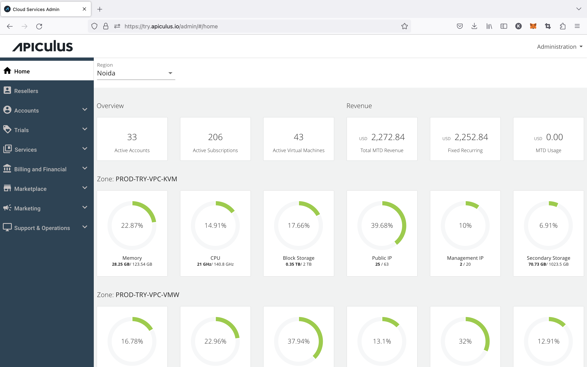

# Admin Console

Apiculus admin console is the top-most experience management layer on the Apiculus solution stack. This is the control panel where service providers' Product, Marketing and Business teams will spend most of their time and manage various facets of the cloud delivery and management experience for the end customers.

Other than a high-level techno-commercial landing dashboard, the admin console offers powerful features and capabilities around:

- [Subscriber account management](/docs/Administration/SubscribersandAccounts/AccountManagementOverview)
- [Trial management](/docs/Administration/TrialManagement/AboutTrials)
- [Billing and financials](/docs/Administration/BillingandFinancials/Overview)
- [Services and catalogue management](/docs/Administration/ServicesManagement/Overview)
- [Marketing management](/docs/Administration/MarketingManagement/Overview)
- [Support and basic operations](/docs/Administration/SupportManagement/Overview)
- [Reseller management](/docs/Administration/ResellerManagement/Overview)
