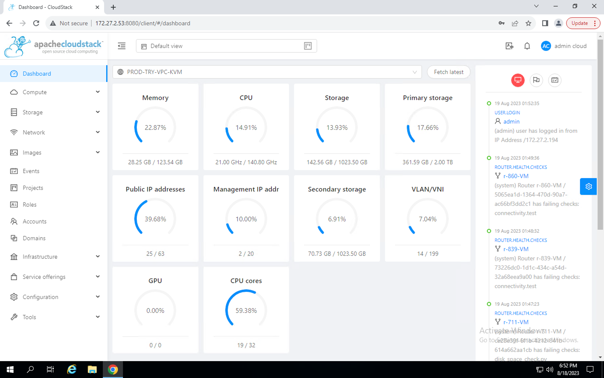

# ISV Consoles

The [Apiculus solution](/docs/Introduction/BuildingBlocks) is built using an 'integrations' approach using ISV products that are enterprise-grade and deliver powerful technical orchestration capabilities.

A standard Apiculus deployment includes the following ISV on which, service provider teams get restricted access:

- Apache CloudStack
- Cloudian HyperStore (if object storage is enabled)
- PowerDNS (if DNS management is enabled)

:::note
Restricted access is provided as any modifications done on the ISV systems can severely impact the quality of service and experience delivered via Apiculus.
:::