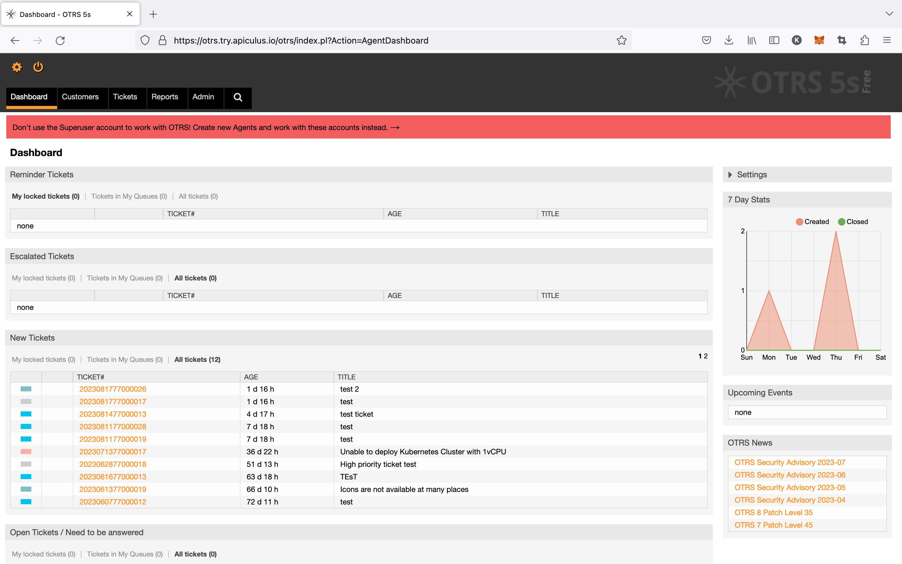

# OTRS Ticketing and Service Interface

Apiculus admin console allows for [end-to-end service management via tickets](/docs/Administration/SupportManagement/End-to-endSupportUsingOTRS) using OTRS Community Edition. Service providers get agent and admin access to OTRS for being able to onboard their helpdesk teams and configure workflows as required.

