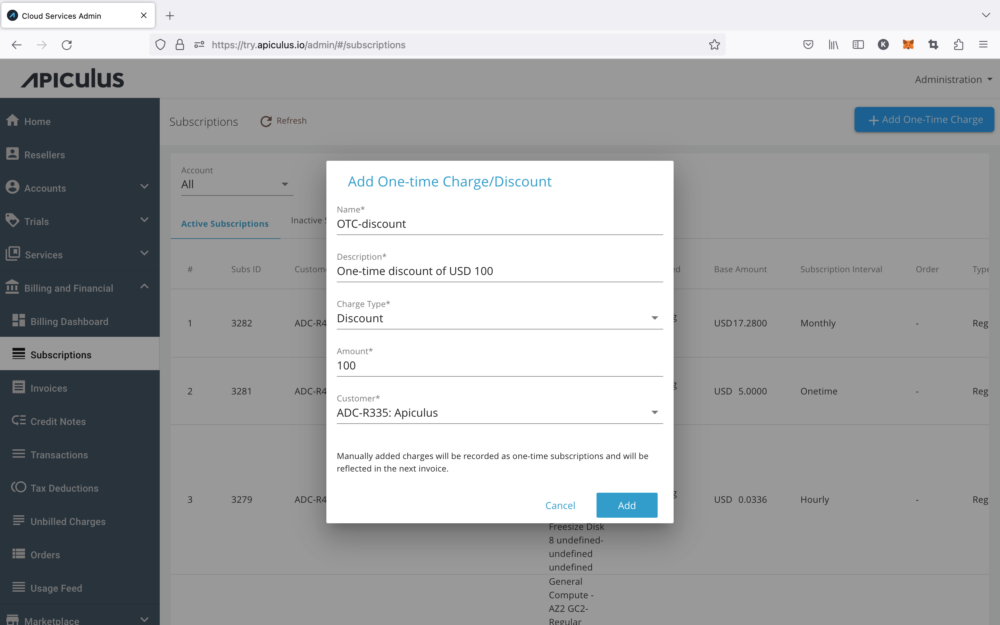

# Adding One-time Charges and Discounts

Administrators can add charges and discounts manually as one-time subscriptions. It is beneficial for the use cases; if the invoice is generated and some discount or charge needs to be recorded for a customer, then admins can do the same. This is an excellent boost to billing-related workflows.

## From Global Subscriptions

Admins need to perform the following steps on the admin portal to add charges and discounts from the global subscriptions section.

1. Navigate to Billing & Financial > Subscription > +ADD ONE TIME CHARGE.
2. Enter the following details:
    - _Name_ 
    - _Description_
    - _Select Charge Type (Charge or discount)_
    - _Enter the amount_
    - _Select a customer from the list of accounts_
3. Click on **add**.

## From Account Subscriptions

Admins need to perform the following steps on the admin portal to add charges and discounts from the account level subscription section.

1. Navigate to Account Management> Select Account> Edit Account> Subscriptions> +ADD ONE TIME CHARGE.
2. Enter the following details:
    - _Name_ 
    - _Description_
    - _Select Charge Type (Charge or discount)_
    - _Enter the amount_
3. Click on **add**.

:::note
- _Manually added charges will be recorded as one-time subscriptions and reflected in the next invoice._
- _Multiple charges and discounts can be added._
:::