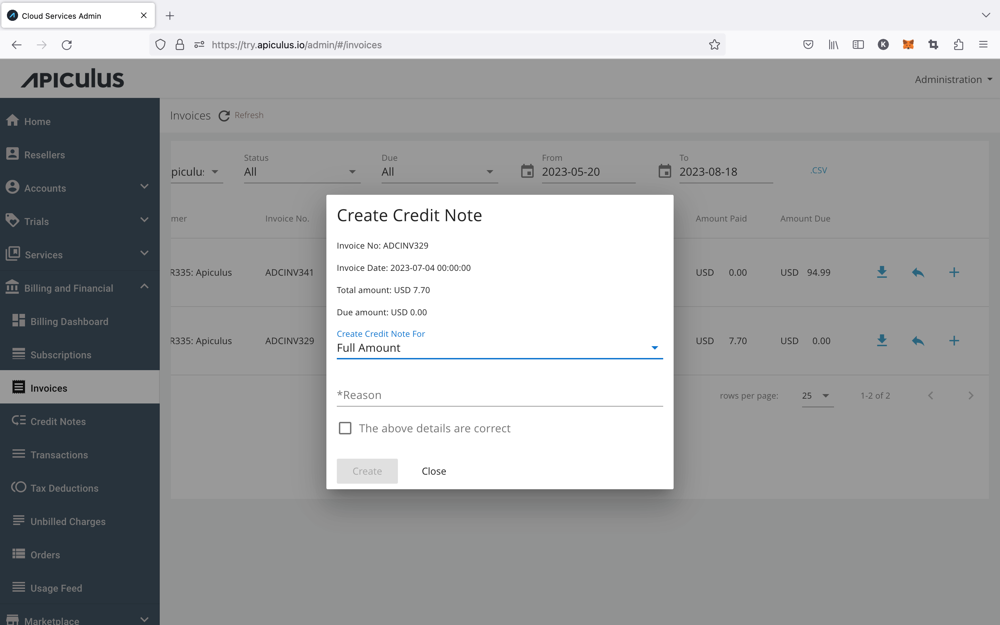

# Creating a Credit Note Against an Invoice

Admins can create credit notes against paid or unpaid invoices. A credit note only requires an invoice to be generated and present in the system. Credit notes can be used in cases such as disputed invoices, disputed charges, refunds etc., where editing an invoice is not financially possible.

Credit notes can be created against any invoice that's present in the account-level or global list of invoices.

Credit notes can be created for _(in increasing order of levels of control offered)_:

- **Complete invoice amount** - generated with a single line item for the complete invoice amount.
- **Partial amount** - generated with a custom amount that can also include a custom/specified tax component.
- **Custom line items** - generated with custom/specified line items with optional tax fields for each line item.
- **Select line items** - generated with line items, taxes and other charges/discounts selected from the linked invoice, with the option to edit individual items.

:::note
The above options are only available when creating credit notes from the Apiculus UI for credit notes created against a single invoice.
:::