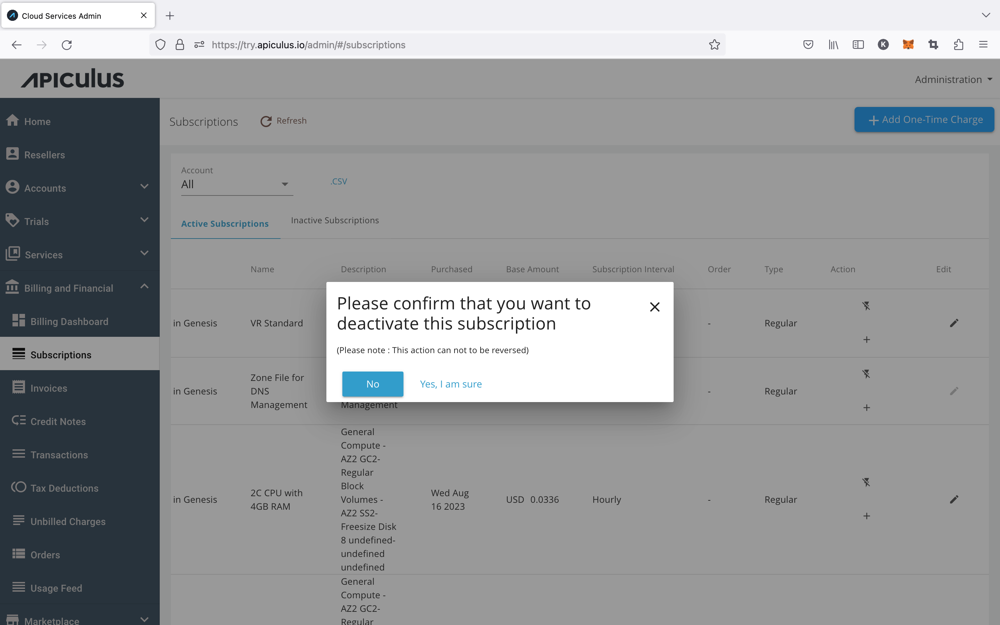

# Deactivating a Subscription

Admins on Apiculus can deactivate subscriptions from the admin console which will, in turn, remove the resource(s) from the corresponding system(s).

This action is available on all subscription lists at the account and global levels.

:::note
Billing on subscription deactivation will follow the pro-ration (on exit) rules defined for the Service under which the subscription exists.
:::