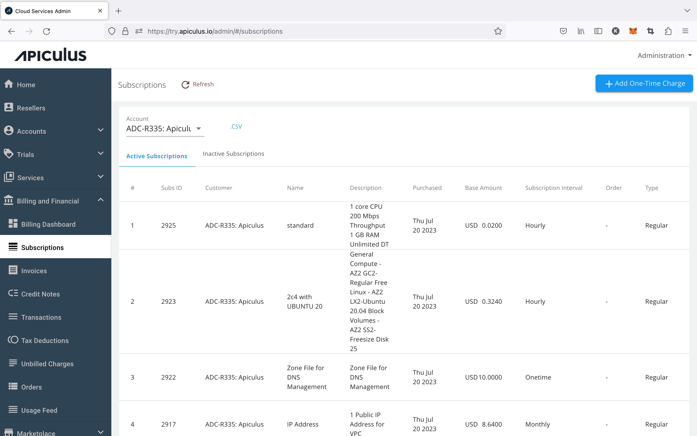
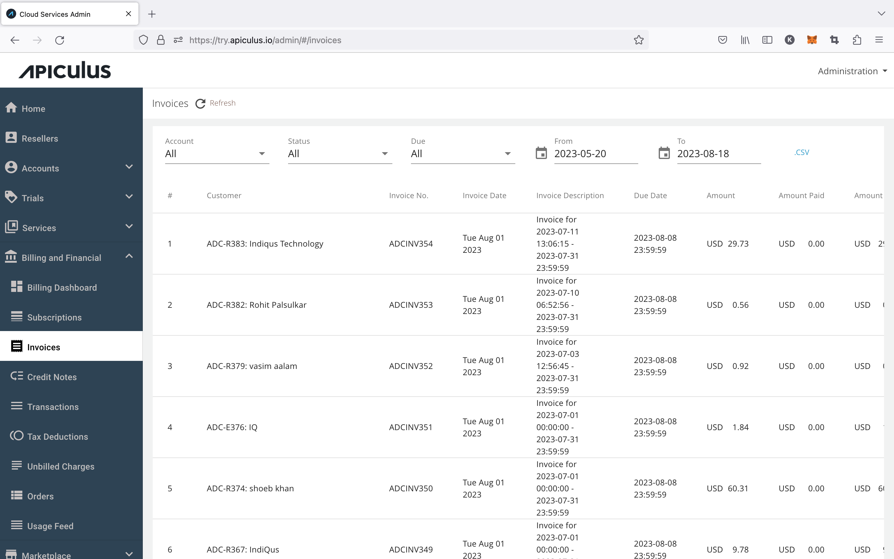
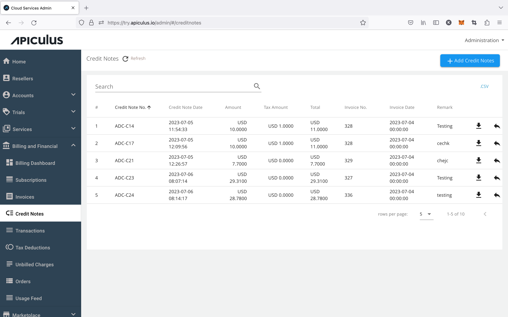
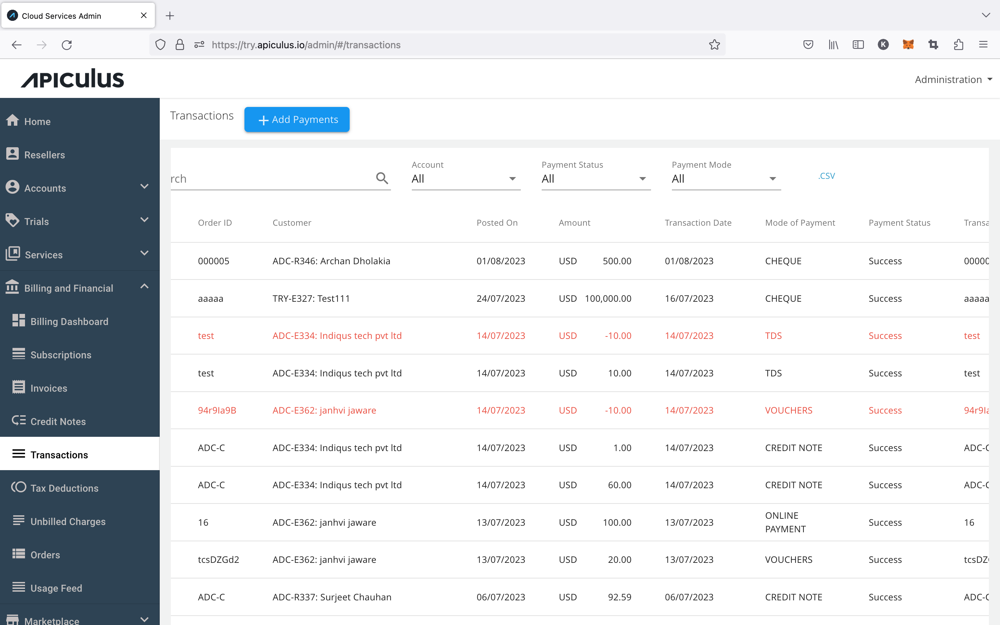
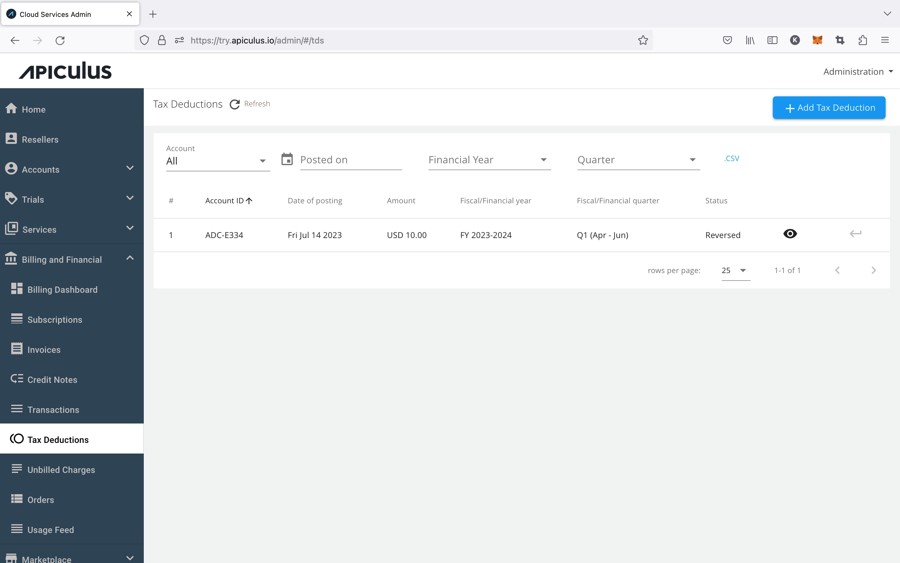
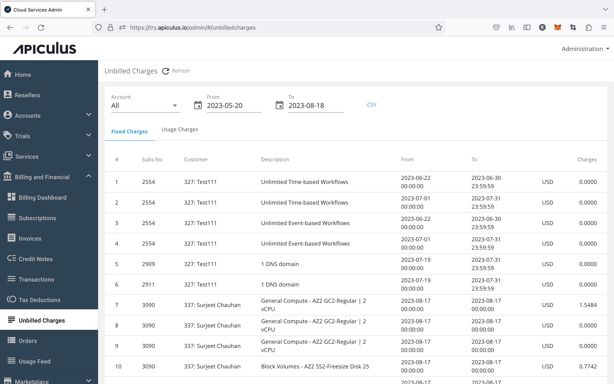
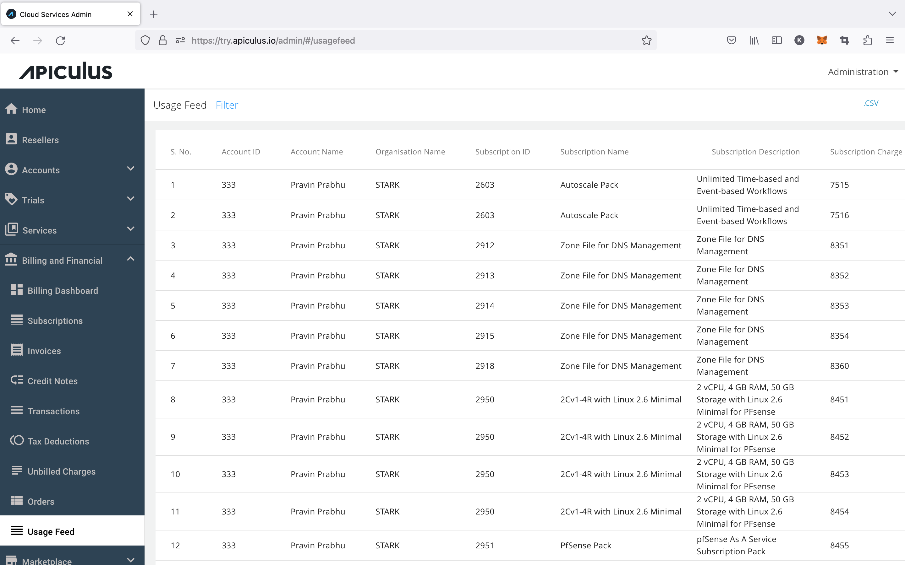

# Overview

The Billing and Financials section (BnF) is designed to give complete details of the Apiculus billing system. The BnF section gives administrators of Apiculus complete access to customers’ billing records, invoices, transactions, and other financial items supported on Apiculus.

:::note
All sections allow downloading of data as a .csv file.
:::

## Subscriptions

This section shows records of all customers’ subscriptions. A subscription is created whenever a resource is purchased (or service is activated) on the Apiculus CloudConsole.

Available actions:

- [Deactivating a subscription](DeactivatingaSubscription)
- _Adding a subscription to an Order (to be deprecated)_
- [Updating subscription charges](UpdatingSubscriptionCharges)
- [Adding a one-time charge or discount](AddingOne-timeChargesandDiscounts)

## Invoices

Invoices are generated on Apiculus for the previous month’s usage on the 1st of each new month. These invoices are automatically generated and emailed to the customers.

Available actions:

- [View/download invoice](ViewingInvoices)
- [Resend invoice](ResendinganInvoice)
- [Create credit note against an invoice](CreatingaCreditNoteAgainstanInvoice)

_**Note** - the invoice template is customisable via a support request to the IndiQus Support team. However, certain information, such as the prefix for the invoice numbering, payment period, and dunning rules are customisable from the Apiculus admin console._

## Credit Notes

Unlike invoices that are generated automatically, a credit note is a supplementary invoice that needs to be manually created. The Credit Notes section lists all such manually created supplementary invoices, along with offering a way for admins to create these credit notes.

Available actions:

- [Creating credit notes](/docs/Administration/BillingandFinancials/CreatingCreditNotesinBulk)
- [Viewing/downloading credit notes](/docs/Administration/BillingandFinancials/ViewingandDownloadingCreditNotes)
- [Resending a credit note](/docs/Administration/BillingandFinancials/ResendingCreditNotes)

:::note
A credit note can be created by downloading the .xls or .ods template and uploading it back to the UI.
:::

_

## Transactions

All customer transaction records (successful, failed, and pending) are displayed in the Transactions section. For transactions done using an online payment gateway via Apiculus, the records are automatically fetched.

Available actions:

- [Adding/recording transactions](/docs/Administration/BillingandFinancials/RecordingTransactionsandOfflinePayments)
- [Viewing transaction details](/docs/Administration/BillingandFinancials/ViewingTransactionDetails)
- [Reversing a transaction](/docs/Administration/BillingandFinancials/ReversingTransactions)
- [Viewing acknowledgment receipt](/docs/Administration/BillingandFinancials/ViewingReceiptsandAcknowledgments)

## Tax Deductions

Apiculus supports recording quarterly tax deductions for all customer invoices. The Tax Deductions section lists all such tax deductions and also allows for adding new items. The Tax Deductions feature is optional and needs to be enabled from the global settings, where admins also get the ability to define their country’s fiscal period and fiscal quarters.

Available actions:

- [Adding tax deductions](RecordingTaxDeductions)
- [Viewing recorded deductions](ViewingTaxDeductions)

## Unbilled Charges

The Unbilled Charges show details of the current month’s billing, i.e., all the billing data from the generation of the previous invoice till the generation of the next invoice.

Available actions:

- _None; list view-only_

Unbilled Charges may also show some negative line items, which indicate a pro-rated subscription exit, or credit or discount that’s applied for a customer. 

## Usage Feed

The Usage Feed shows the total units of each service or resource consumed in the previous month. This is a view-only section that shows each subscription line item, it's unit of measurement, charge type, and the total units consumed in the chosen billing cycle.

Available actions:

- _None; list view-only_

