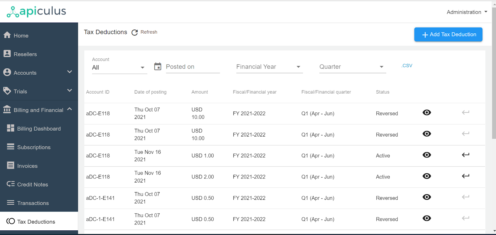
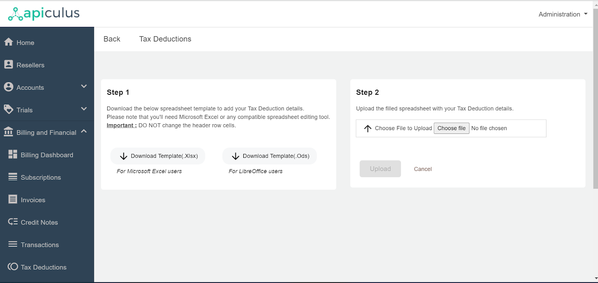
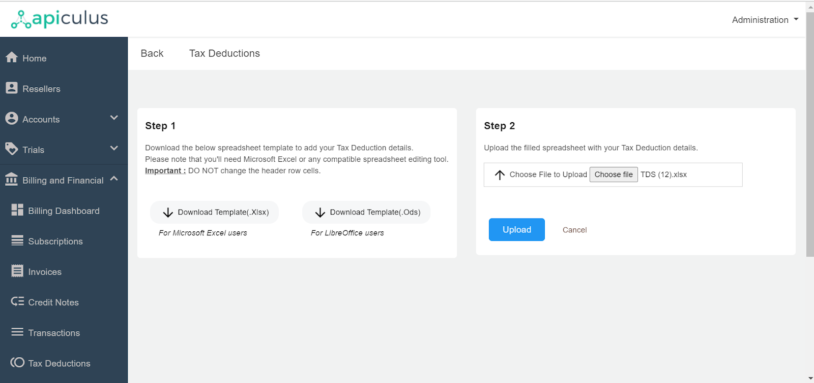
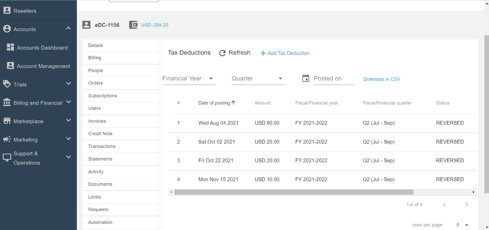
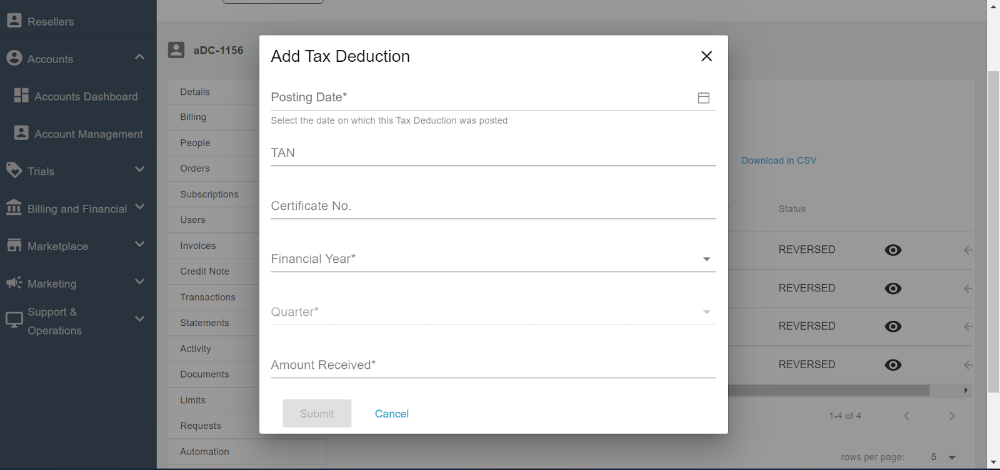

# Recording Tax Deductions

Admins can configure tax deductions via a new section under Settings called Tax Deductions. _This involves taxes deducted by the customers while making a payment and is different from taxation on services which involves taxes charged on the services delivered_. Admins can record quarterly tax deductions for all customer invoices. The Tax Deductions section lists all such tax deductions and also allows for adding new items. The Tax Deductions feature is optional and needs to be enabled from the global settings, where admins also get the ability to define their country’s fiscal period and fiscal quarters.

## Configuring Tax deductions

Admins need to perform the following steps for [configuring the Tax deductions](/docs/GettingStarted/BillingandFinancials/ConfiguringTaxDeductions).

1. Navigate to **Global Settings > Tax Deduction > Enable the Tax Deductions Switch**.
2. Enter the Tax Name as applicable.
3. Enter the Tax Account ID Name
4. Select the quarter from the list of Fiscal/Financial years.
5. Click on Save and proceed with the publish settings.

## Accessing and Adding Tax Deductions 

Tax Deductions can be accessed and added in two ways, i.e., in the Global Tax deduction section and from the account level.

### Global Tax Deductions Section

1. _Navigate to the Tax Deduction under the Billing and Financial section in the main navigation panel._
2. _It will list down all the accounts posting that have been recorded. It will include the following details:_
    1. _Account ID_
    2. _Date of Posting_
    3. _Amount_
    4. _Fiscal/Financial Year_
    5. _Fiscal/Financial Quarter_
    6. _Status_

3. _Admins can view the details by clicking on the Eye icon._
4. _Admins can also reverse the transaction by clicking on the arrow icon_.
5. _Admins can also filter using the options available above the table_.

For adding the tax deduction from the global section, click on the **+ Add Tax Deduction** and then download the template and upload the template by filling in the required details.

### Account Level Tax Deductions Section

1. _Navigate to the_ **_Accounts Management > Select Account > Edit Account > Tax Deductions._**
2. _It will list down all the accounts posting that have been recorded. It will include the following details:_
    1. _Account ID_
    2. _Date of Posting_
    3. _Amount_
    4. _Fiscal/Financial Year_
    5. _Fiscal/Financial Quarter_
    6. _Status_

3. _Admins can view the details by clicking on the Eye icon._
4. _Admins can also reverse the transaction by clicking on the arrow icon_.
5. _Admins can also filter using the options available above the table_.

For adding the tax deduction, click on the **+ Add Tax Deduction**, and then a pop-over dialogue box will open. Fill in the required details and click on **Submit**.

