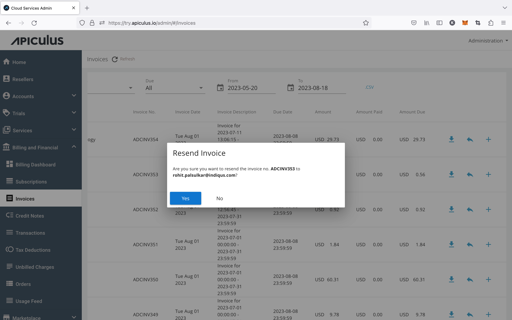

# Resending an Invoice

Invoices on Apiculus are automatically sent to customers upon generation. However, there may be cases where the email couldn't reach the customer, was deleted by mistake, or any other way that the email could not be retrieved. For such cases, invoices can be resent to the account. This can be done by using the 'resend' option on account-level or global list of invoices.

:::note
This does not regenerate an invoice. The same invoice is sent again to the same recipient.
:::