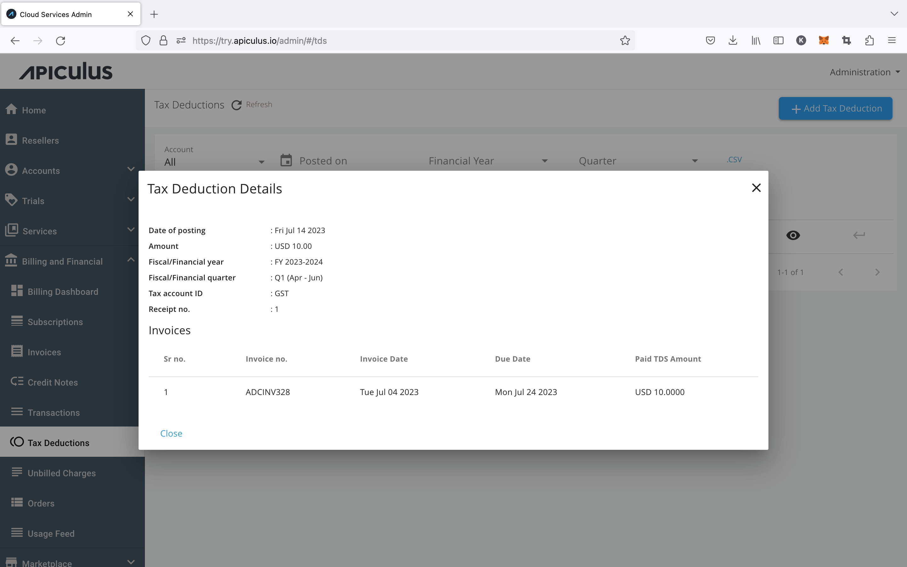

# Viewing Tax Deductions

[Tax deductions recorded quarterly](https://docs.apiculus.com/hc/en-in/articles/12890520108189) against historical invoices can be viewed as per [fiscal period configurations](https://docs.apiculus.com/hc/en-in/articles/12614903992349) on Apiculus. This detail is available on clicking the _eye_ icon on any account-level or global listing of tax deductions.

