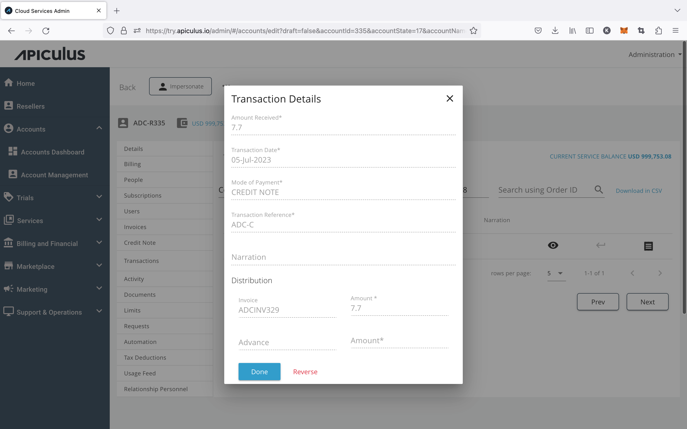

# Viewing Transaction Details

Payments and transactions (online and offline), once recorded on the system, can be viewed in detail w.r.t. their amounts, dates, references, modes, narrations and apportionings.

Any transaction detail can be viewed by clicking on the _eye_ icon in an account-level or the global list of transactions.

