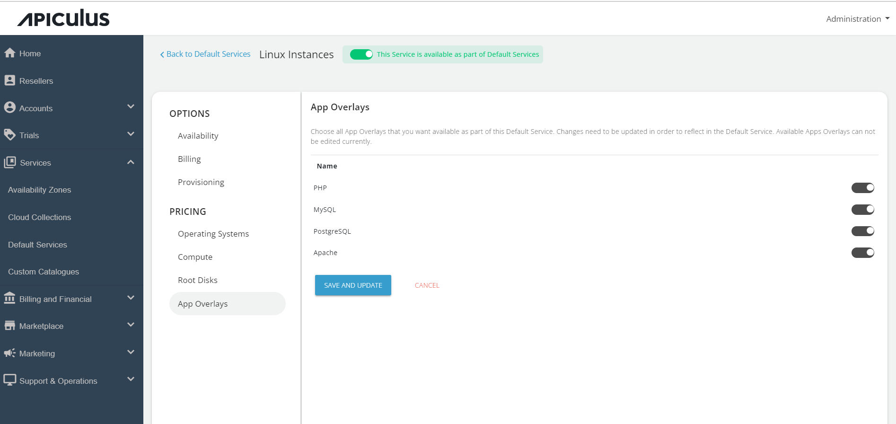

# Configuring App Overlays

Admins have the ability to set up the applications accessible to end-users during the deployment of a Linux instance. Presently, these specific applications are exclusively accessible for Linux Instances.  
## Configuring Apps

To configure App Overlays, follow these steps:

1. Go to the default services in the primary navigation menu.
2. Select "Linux Instances" under the Compute section.
3. Follow the standard configuration steps as per the requirement for Availability, Billing, Pricing for OS, COMPUTE, and Root Disks.
4. Navigate to the "App Overlays" section under Pricing.
5. View the list of currently available apps, such as SQL, PostgreSQL, Apache, PHP.
6. Use the switch to enable or disable these applications as needed.
7. Return to the Default Services and click on "PUBLISH DEFAULT CATALOGUE."

With these steps completed, the App Overlays are now configured and available for end-users.