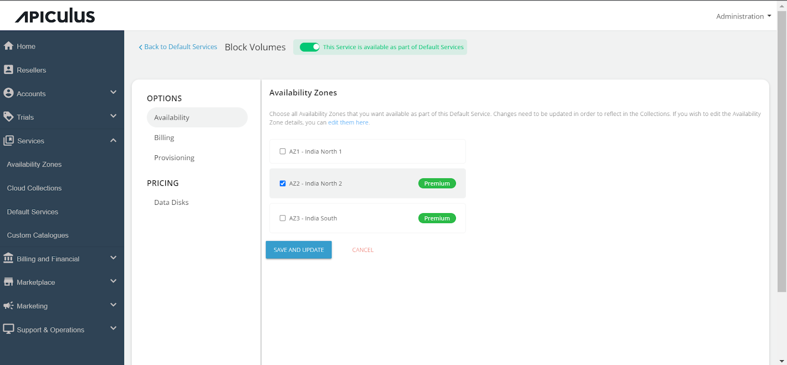

# Configuring Block Volumes

Follow these steps to configure Block Volumes:

1. Access the **_Default Services_** in the main navigation menu.
2. Choose "**Block Volumes** " within the Storage section.
3. Turn on the switch at the top to make this service available as part of the default services. This action will enable all associated sections.
4. Move to the **_Availability section_**. Choose the availability zone from which you want to offer the service, then click "_**Save & Update**._" 

5. Within the **Billing section,** two options are available: 
	- Prorate on Entry
	- Prorate on Exit

6. Block Volumes can be provisioned to an approval-based system within the **Provisioning** **section**. This is done by activating the "**Approval Required**" switch, offering additional functionalities such as sending custom instructions to end-users upon approval and attaching up to five files, each up to 3 MB.

Further, the _PRICING_ options include:

- Clicking on the **Data Disks** under Pricing, then select Availability Zone, enable specific packs within collections, and define the pricing you want to offer the end users.

Finally, return to Default Services and click "**PUBLISH DEFAULT CATALOGUE.**"

