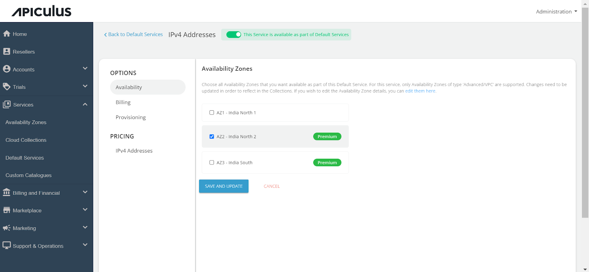
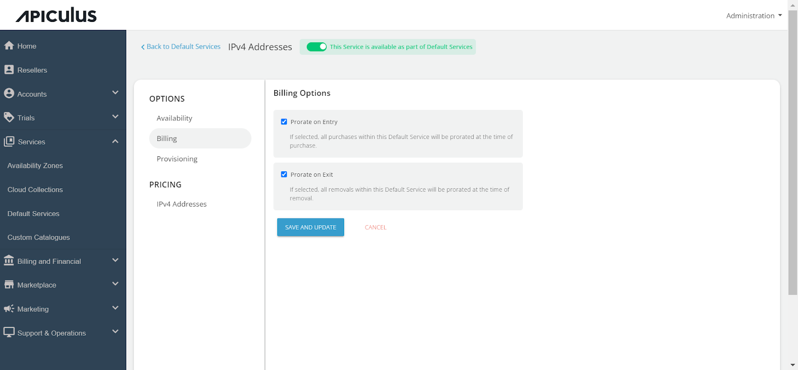
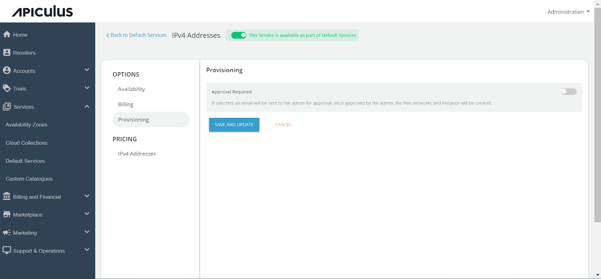
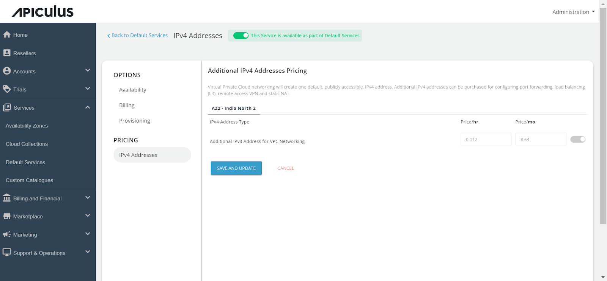

# Configuring IPv4 Addresses

Follow these steps to configure IPv4 Addresses :

1. Navigate to the **Default Services** in the primary menu.
2. Choose "_**IPv4 Addresses**_" within the **Compute** section.
3. Activate the switch at the top, indicating the availability of this service as part of the default services. All associated sections will become enabled.
4. Proceed to the **Availability section**. Select the desired availability zones from which you want to deliver the service to the end user, then click "**Save & Update.**"

5. Within the Billing section, two options are available: 
	- Prorate on Entry
	- Prorate on Exit

6. IPv4 Addresses can be provisioned to an approval-based system within the _Provisioning_ section. This is done by activating the "_Approval Required_" switch, offering additional functionalities such as sending custom instructions to end-users upon approval and attaching up to five files, each up to 3 MB.

Further, the _PRICING_ options include:

7. Click on the _**IPv4 Addresses**_ to enable the switch for the _Additional IPv4 Address for VPC networking_ and define the pricing that you want to offer to the end-user.

Finally, return to Default Services and click "**PUBLISH DEFAULT CATALOGUE.**"

