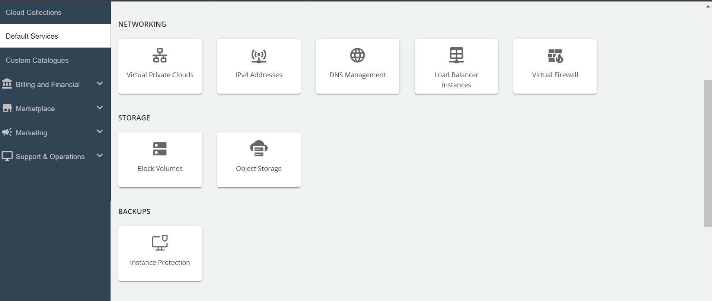
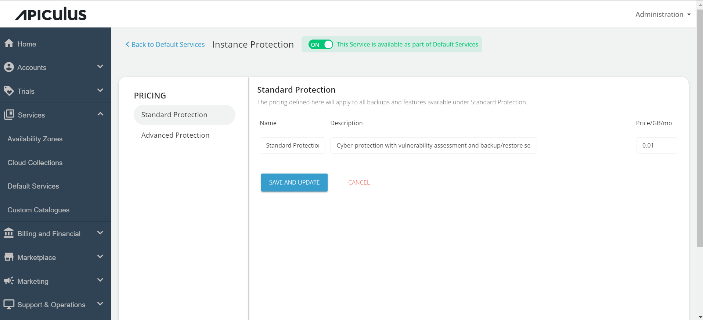
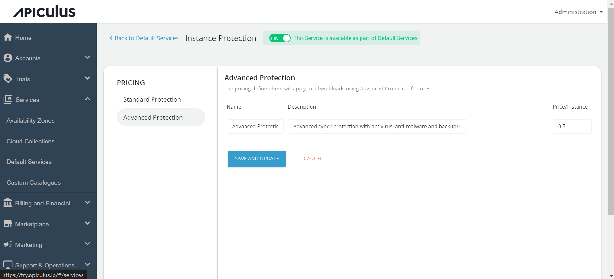
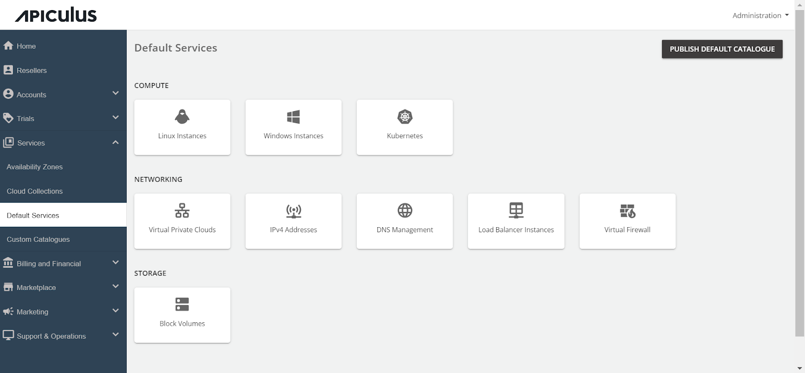

# Configuring Instance Protection

Administrators can configure _Instance Protection_ via the _Default Services_ section using these steps:

1. Navigate to the default services in the primary menu.
2. Choose "Instance Protection " within the Backups section.

3. Activate the switch at the top, indicating the availability of _this service as part of the default services_. All associated sections will become enabled.

4. Click on the **Standard Protection** section and specify the _price in GB/Mo_ as per your requirement in the standard protection section. This price will be displayed to the end-user and will be charged to them as per the usage.

5. Click on the **Advance Protection** section and specify the _price per Instance_ as per your requirement in the advance protection section.

6. Click on SAVE AND UPDATE to save the changes you made.

Finally, return to Default Services and select "**PUBLISH DEFAULT CATALOGUE**."

