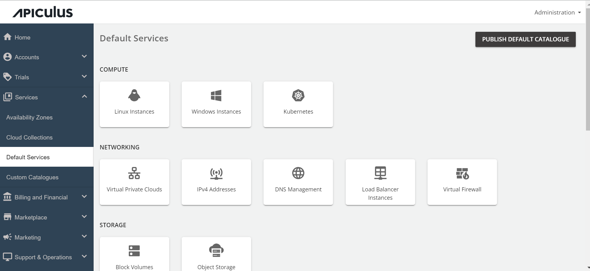
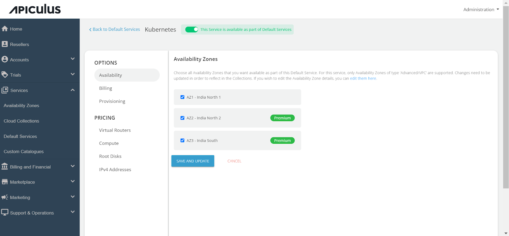
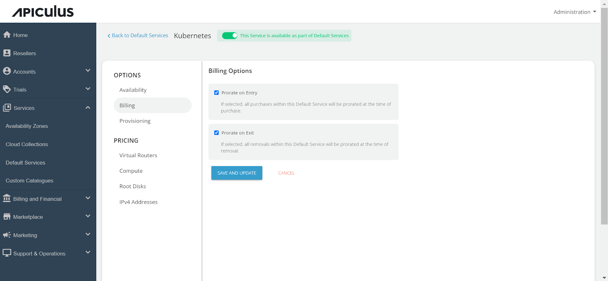
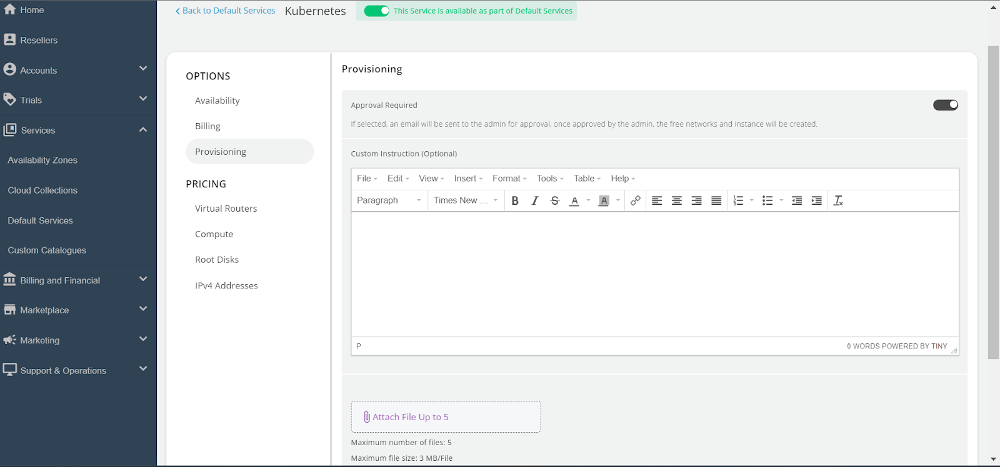
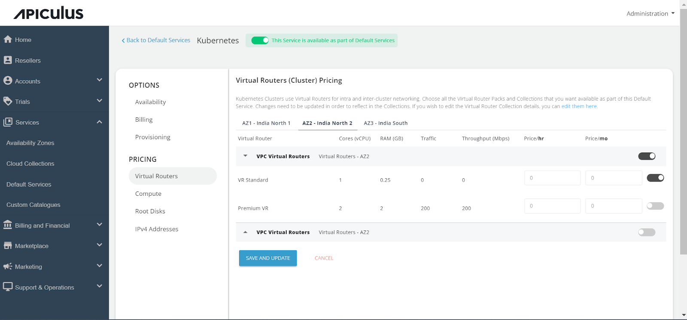
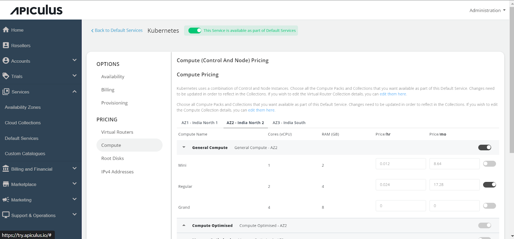
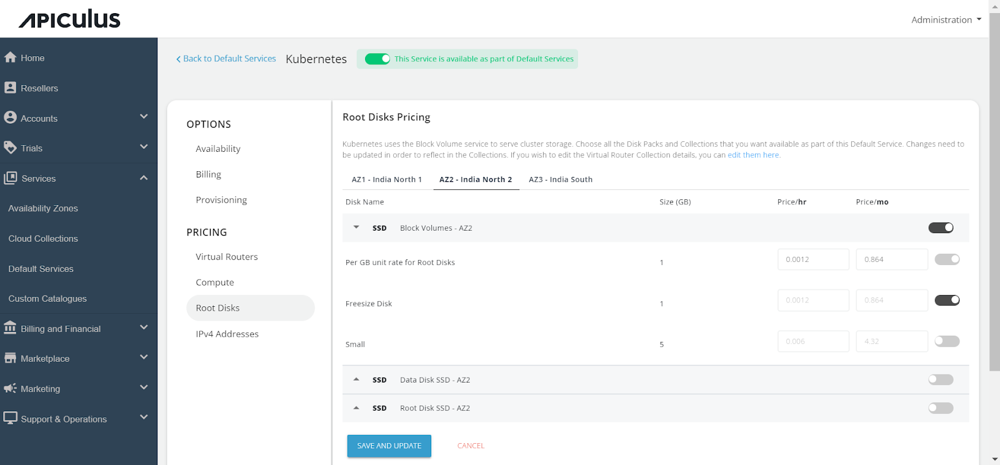
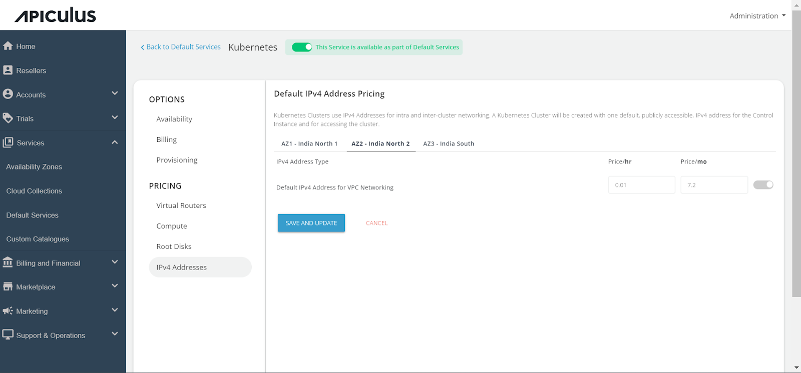

# Configuring Kubernetes Service

Follow the below steps to configure the Kubernetes Service:

1. Navigate to the _Default Services_ in the primary menu.
2. Choose "**Kubernetes**" within the _Compute_ section.

3. Activate the switch at the top (This service is available as part of default services). All associated sections will become enabled.
4. Proceed to the _Availability_ section. Select the desired availability zones for offering the service, then click "_Save & Update_."

5. Within the _Billing_ section, two options are available: 
	- _Prorate on Entry_
	- _Prorate on Exit_

6. Kubernetes service provisioning can be offered as an approval-based system from the _Provisioning_ section. This is done by activating the "A_pproval Required_" switch, offering additional functionalities such as sending custom instructions to end-users upon approval and attaching up to five files, each up to 3 MB.

Further, the _PRICING_ options include:

a. Click on "_Virtual Routers_" under the Pricing section, then select the _Availability Zone_. Enable the collections or specific packs within a collection, and specify the pricing for your selection.

b. Access the _Compute_ section, select _Availability Zone_, Enable the collections or specific packs within a collection, and specify the pricing for your selection.

- In the _Root Disks_ section, select the A_vailability Zone_, Enable the collections or specific packs within a collection, and specify the pricing for your selection.

- in the _IPv4 Addresses_ section, click on the _Availability Zone_ and specify the pricing for the Default IPv4 address.

Finally, return to _Default Services_ and select "**PUBLISH DEFAULT CATALOGUE**."

