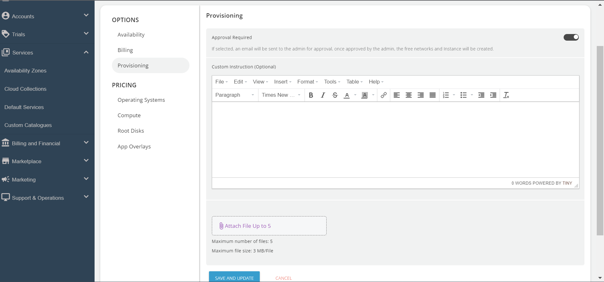
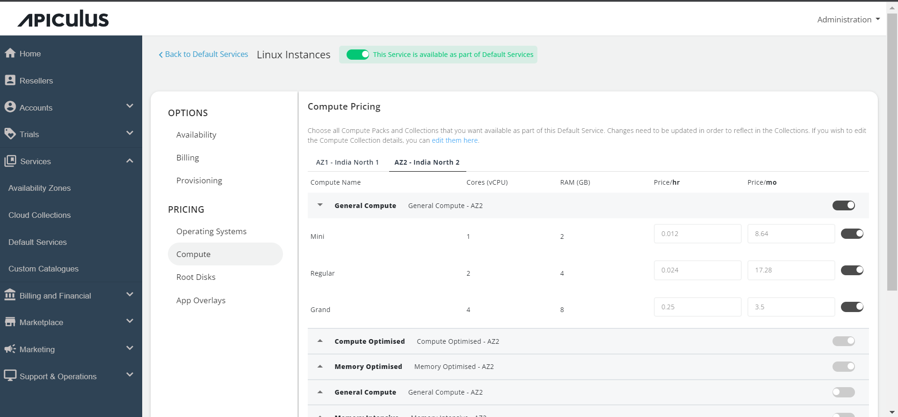

# Configuring Linux Instances

Follow these steps to configure Linux Instances:

1. Go to the _**Default Services**_ in the primary navigation menu.
2. Select "**_Linux Instances_**" under the _Compute_ section.
3. Turn on the switch at the top to make this service available as part of the default services. This action will enable all associated sections.
4. Move to the **_Availability section_**. Choose the availability zone from which you want to offer the service, then click "**_Save & Update_**.

 

5. Click on the **_Billing section_**; the following two options will be listed. i. Prorate on Entry and Prorate on Exit.

 

7. Linux Instances can be provisioned to an approval-based system within the **_Provisioning_** section. This is done by activating the "**Approval Required**" switch, offering additional functionalities such as sending custom instructions to end-users upon approval and attaching up to five files, each up to 3 MB.

7. Click on the _**Operating System**_ under Pricing, Click on the Availability Zones, and enable the particular packs inside the collections.

8. Click on the _**Compute section**_. , click on the Availability Zone, and enable the compute pack of the specific collection you want to offer to the end user.

9. In the _**Root Disks** section_, select the availability zone and enable packs for the designated collection.

10. If you want to offer the apps, click the **_App Overlays_** section and enable the listed apps.

11. Return to the Default Services and click "**PUBLISH DEFAULT CATALOGUE.**"

 