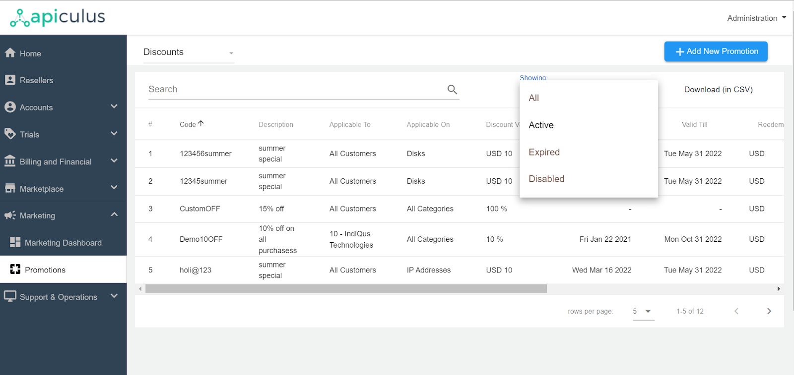
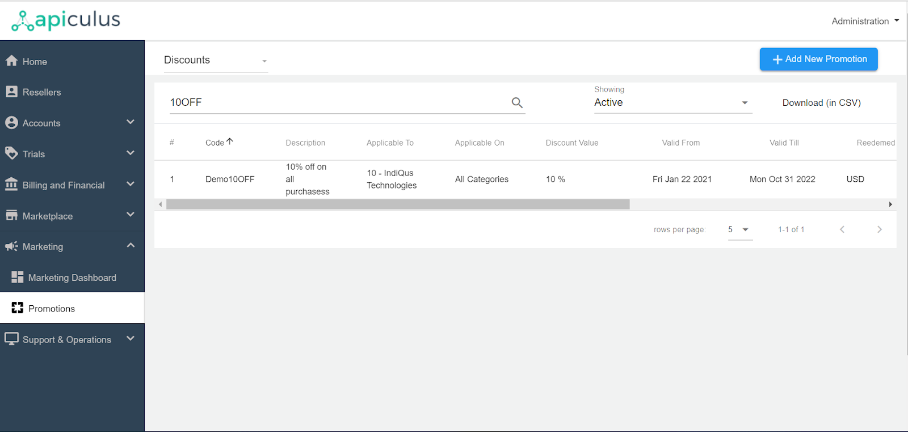
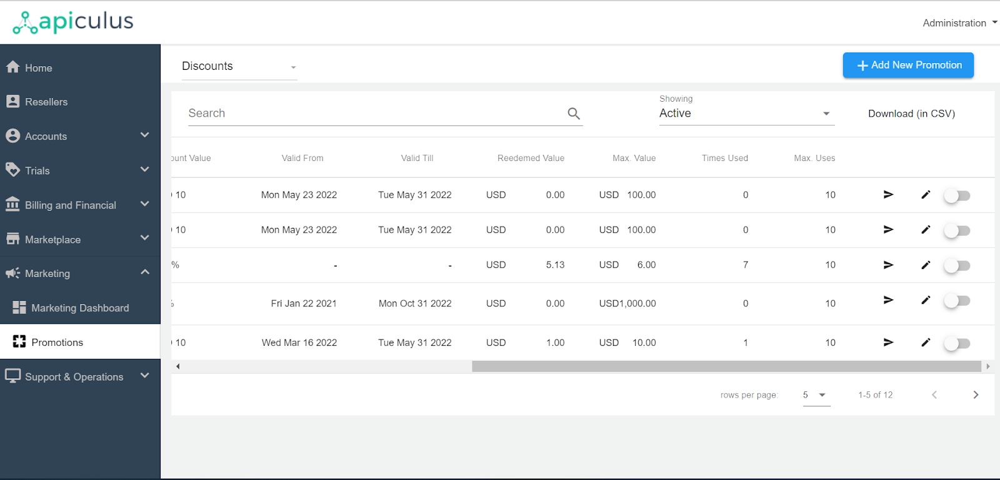
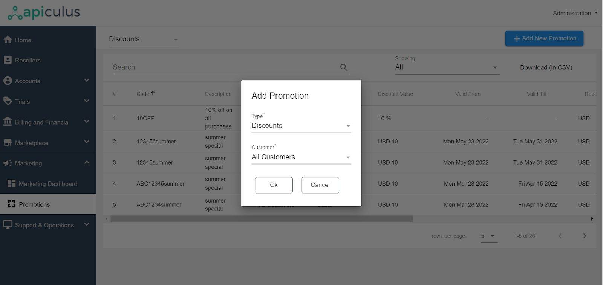
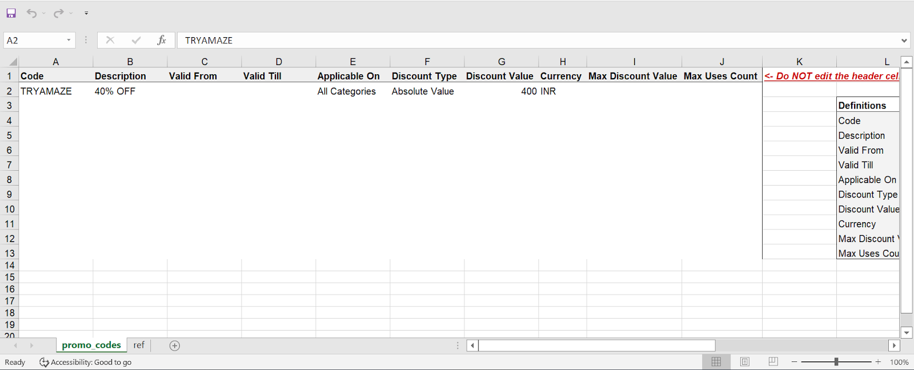
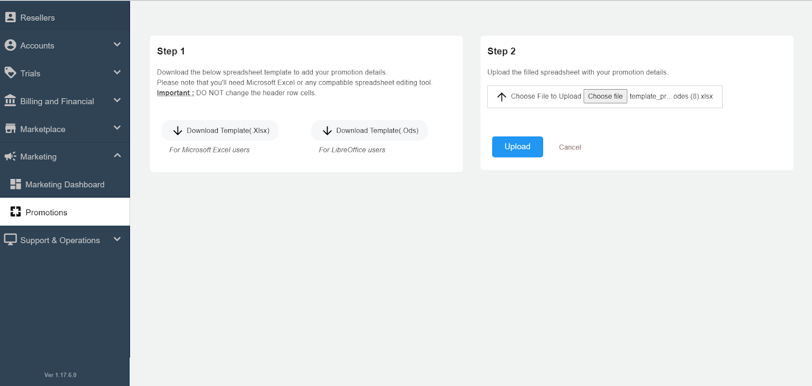
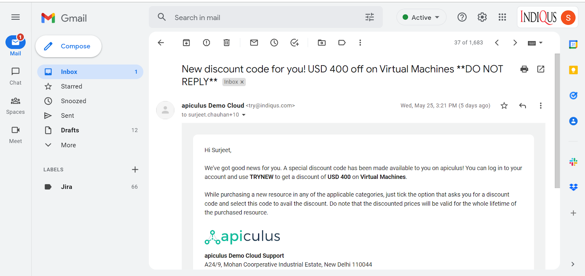

# Working with Discount Codes

## Viewing Discount Codes

Discount Codes can be accessed from the **Marketing > Promotions** section on the main admin navigation panel. By default, it shows the Discount Codes. Details are listed below:

1. It shows the information of all the discount codes that have been created till now. In addition, the active, expired, and disabled discount code information can be filtered and viewed using the showing filter.

2. There is a search option also for searching the discount code.

3. The various information about the discount codes that are listed is as follows.

	- Discount Code- _This is the code displayed to the customer (e.g., DIWALI10OFF)._
	- Description- _Specifies the description of the promotion (e.g., 10% off on all purchases)._
	- Applicable To- _To which customer this code is applicable. It can be for a particular customer or for all customers._
	- Applicable On- _Codes can be applied to all categories or a single product category._
	- Discount Value- _Specified Discount Type_
	- Valid From- _The starting date can be blank also, which means it can be redeemed from the time it has been created_ 
	- Valid Till- _The discount expiry date can also be blank, which means that it doesn’t have any expiry date associated with it_
	- Redeemed Value-_This specifies the Value that the customer has already used_
	- Maximum Value- _This is the maximum value of the discount that a customer can avail of._
	- Times Used- _How many times this particular discount code has been used._
	- Maximum Uses- _This is the maximum limit up to which the customer can use the discount code._

4. This information can also be downloaded in the .CSV format.
5. These discount codes can be edited by clicking on the pencil button and enabled/disabled by using the switch button.

## Adding Discount Codes

1. Admins need to click on the **+ Add New Promotion** button from the top right corner.
2. After that, they need to specify the **Discount** as a type and select customer; they can select all customers, or specific customers can also be chosen from the list and click on **Ok**.

3. Admins need to download the template, Xlsx and .Ods templates are available.

4. The details in the template must be filled in by the admins.

5. The final step is to choose the file and upload it; the details will be visible under the promotion section once uploaded successfully.

## Sending the Discount Code to the Customer

Now the discount codes can be emailed quickly to the specific customer by simply clicking the notify button. On clicking it, the admin is shown a confirmation pop-over, and by clicking **Confirm**, it will send an email to the customer.

## Applying Discount Codes

Subscribers/customers can view and apply all available Discount Codes at the time of purchase confirmation on all supported Services on Apiculus CloudConsole.

:::note
Discount-deflated amounts are lifelong, i.e., any Service subscribed at a discounted rate using a Discount Code will carry the discounted price for its lifetime.
:::