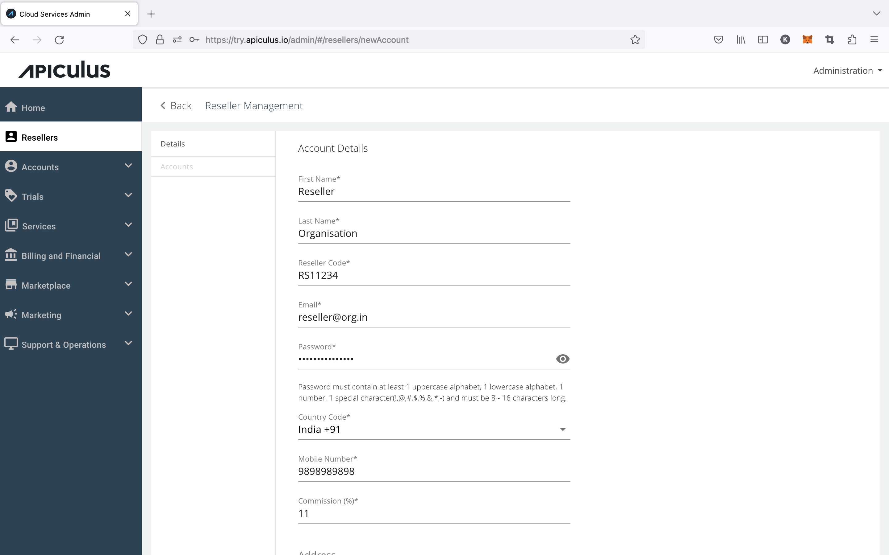

# Creating and Updating Resellers

:::note
[This feature requires the reseller module to be enabled.](/docs/GettingStarted/AdvancedConfigurations/EnablingResellerModule)
:::

Resellers can be created by navigating to the **Resellers** section on the main navigation panel. Apiculus lets admins create custom reseller codes for each reseller, which can be used during subscriber account creation.

Admins can define a 'commission percentage' while creating a reseller. This information can be used at the time of managing billing between the service provider and the reseller.

:::note
Reseller billing is not handled on the Apiculus platform as all invoices are generated on the system and sent directly to the end customers.
:::

## Updating a Reseller

Reseller details can be updated by navigating into a reseller from the list of resellers. 

:::note
Reseller code, once published, can not be edited.
:::