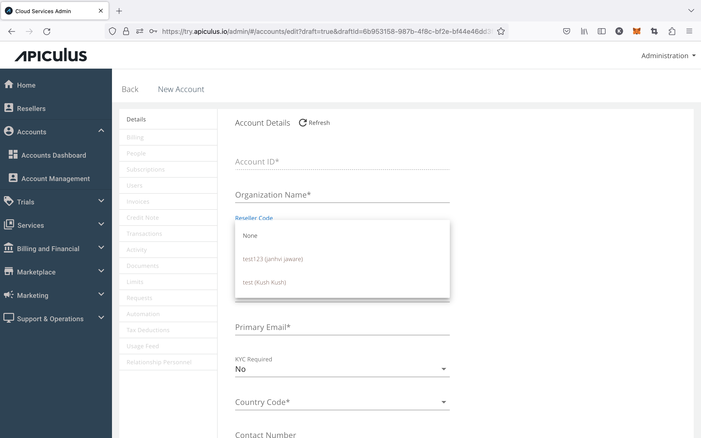
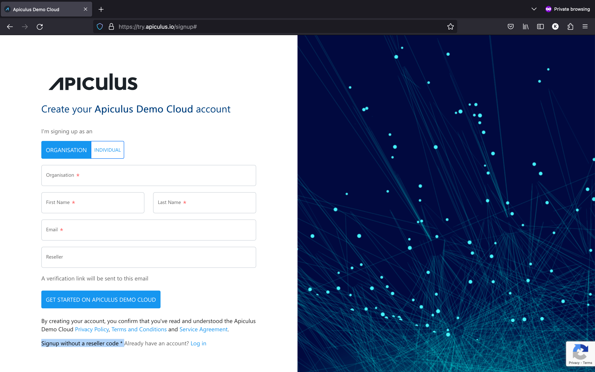
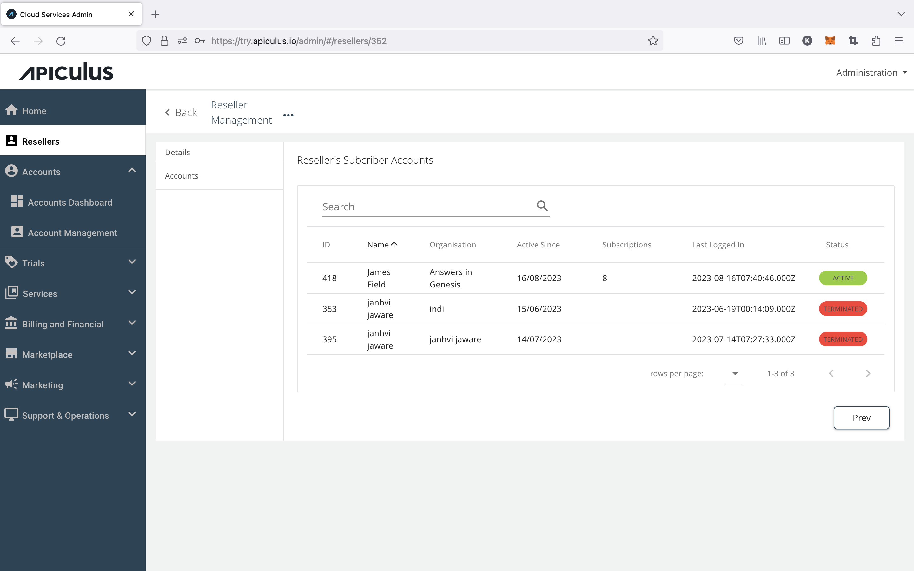

# Managing Reseller-tagged Accounts
:::note
[This feature requires the reseller module to be enabled.](/docs/GettingStarted/AdvancedConfigurations/EnablingResellerModule)
:::

## Creating Reseller-tagged Accounts

### Admin-assisted Tagging

New accounts can be tagged to an existing reseller. When a subscriber account is being created/verified by an admin, all available reseller codes will be shown to the account creator in a dropdown menu.

 

### Self-signup Tagging

The self-signup form can be used with a reseller code by clicking on the _I have a reseller code_ option on the signup form. This will show an additional text input for specifying a known (and valid) reseller code.

 

## Viewing Reseller-tagged Accounts

Reseller-tagged accounts can be viewed by navigating to the details of a reseller and going into the _Accounts_ sub-section.

 

## Updating Reseller-tagged Accounts

Reseller-tagged [accounts can be managed and updated](/docs/Administration/SubscribersandAccounts/CreatingandUpdatingSubscriberAccounts) in the same way as regular subscriber accounts.

:::note
Reseller tags can not be updated via the UI. In order to do so, please raise a request to Apiculus Support.
:::