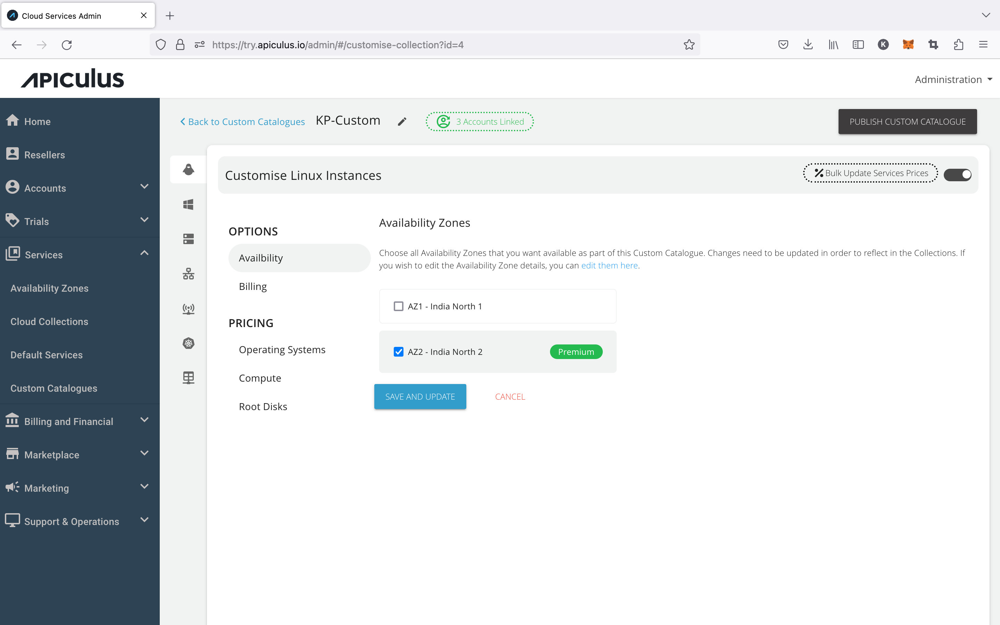

# Assigning Custom Catalogues to Customers

[Custom Catalogues](WorkingwithCustomCatalogues) can be assigned to one or more customers using the Apiculus admin console. This is a guided workflow on the Apiculus admin console UI and can be done in simple steps.

1. Navigate to **Services > Custom Catalogues** and go into the catalogue that needs to be associated with one or more customers.
2. The screen will show how many customers are linked to this catalogue and clicking the counter (green button) will open up details of which customers are linked.

3. To add more customers, open the **Account to Link** dropdown and select all the customer accounts that need to be linked to this catalogue.
4. If any of the customers is already linked to another Custom Catalogue, the system will flag it and give a prompt to accept this new linkage or retain the existing one.

5. Once all the desired changes are done, **publish** the catalogue.

:::note
If the newly-linked customer is already on any resource creation/purchase page on the Apiculus CloudConsole at the time of publishing the edits, their purchase will fail.
:::