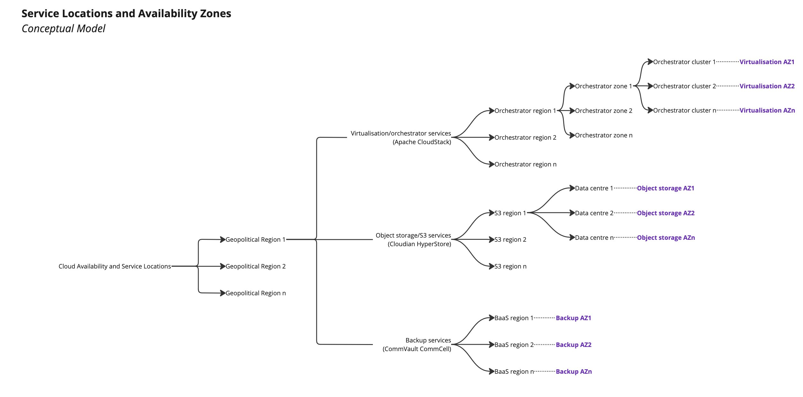

# Working with Availability Zones

Availability Zones (AZ) on Apiculus are a highly versatile and unique way of managing Service delivery and availability. Apiculus AZ are essentially control planes for underlying ISV, which are set up to handle a host of delivery scenarios. Apiculus AZ also take into consideration the limitations that an ISV may bring (e.g., inability to manage multiple serviceable regions via a single management plane). In other words, Apiculus AZ may be seen as the 'delivery-level unification' of all underlying cloud services into a service topology.

The following is a description of AZ for each type of Service that uses AZ:

|Service|Availability Zone|
|---|---|
|Linux/Windows Instances|CloudStack-based|
|Block Volumes|
|Virtual Private Clouds|
|IPv4 Addresses|
|Kubernetes|
|Load Balancer Instances|
|Virtual Firewall Instances|
|Secondary Storage & Data Transfer|
|Metal Instances|MAAS-based|
|Object Storage|HyperStore-based|

## Mapping an Availability Zone

For mapping a new availability zone, navigate to **Services > Availability Zones** and click on the **+ MAP NEW AVAILABILITY ZONE** button, and pop over the window that will open up and fill in/ choose the following details:

1. **AVAILABILITY ZONE** – _The name you want to display or call this availability Zone._
2. **REGION** – _Choose any regions listed; these regions’ data will be displayed as configured on the ACS._
3. **CLOUDSTACK ZONE** - _Choose any of the listed zones._
4. **HYPERVISOR**- _Choose any of the hypervisors available in the list._
5. **CLUSTER**- _Choose any of the available clusters in the list._
6. **LABEL** – _Choose any of the available labels. Currently, there are two labels present, i.e., Basic and Premium._

Once you have filled in and chosen the above options, click on the **CREATE AVAILABILITY ZONE.**

If you want to save these created availability zones as a draft, click on the **SAVE AS DRAFT** button and, cancel the action, click on the **CANCEL** button.

:::danger
Disabling or Deleting an AZ will cascade into all the Cloud Collections, Default Services and Custom Catalogues that use the AZ.
:::

:::note
Currently, only the option to map CloudStack-based AZ is available on the Apiculus admin console UI. Support for other types of AZ is being developed.
:::