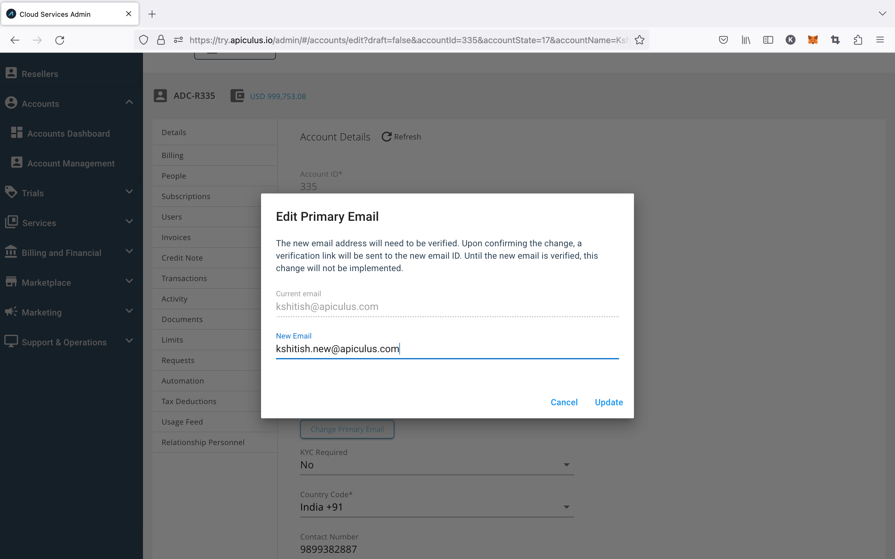
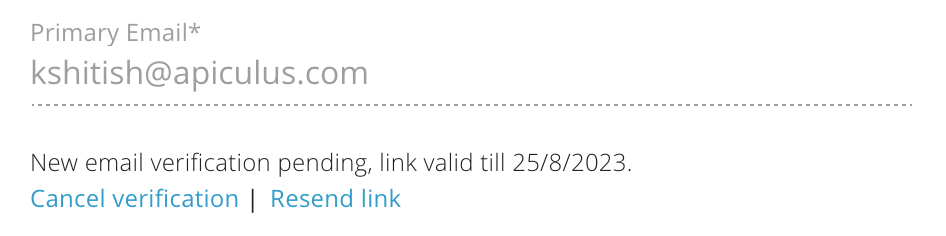

# Changing Subscriber’s Primary Email

Apiculus admin console gives the option of changing the customer’s primary email ID. The customer's primary email ID can be changed anytime in simple and verifiable steps, and the notification will go to both the new and old email IDs.

## Steps for Changing the Primary Email

1. Navigate to Account Management > Select Account> Edit Account > Account details > Primary Email Change

2. Click on Primary Email Change, enter the new email ID, and click on Update.
3. An email will be sent to the updated email ID.

Admins can cancel this process by clicking on the _Cancel verification_ link; this will cancel the email change process. They also can resend the verification link by clicking on _Resend link_.

The subscribers need to click the **link** or **Confirm** button they received on the new email ID and enter the **verification code** received in the email.

End-users will be able to login into the platform with the updated email ID and the password.

:::note
Once the primary email transfer is completed, an email will be delivered to the new and old addresses.
:::

## Subscriber-initiated Primary Email Change

Subscriber admins can initiate this action from their [organisation/account profile section in Account Centre](https://docs.apiculus.com/hc/en-in/articles/12844188566685).