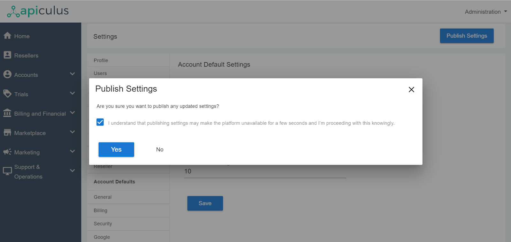

# Working with KYC and Account Verification

Apiculus admin console allows setting up default KYC-based restrictions for both self-signup and admin-assisted accounts. If selected, the respective account types will not be able to purchase anything till their KYC/identity verification has been completed.

## Configuring KYC For Self-Signup Accounts

For setting up the KYC for self- signup accounts, admins need to perform the following steps on the admin portal.

1. Navigate to Global Settings > Account Defaults > Require KYC for Self-signup Accounts.
2. Switch on the Require KYC for Self-signup Accounts.
3. Click on the Save button to successfully save the updated configuration.
4. Final step is to publish the saved settings by clicking the Publish Settings button from the top right corner.

:::note
This setting will apply to all accounts that are created using the self-signup method.
:::

## Configuring KYC For Admin-assisted Accounts

For setting up the KYC for admin-assisted accounts, admins need to perform the following steps on the admin portal.

1. Navigate to Global Settings > Account Defaults > Require KYC for Admin-assisted Accounts.
2. Switch on the Require KYC for Admin-assisted Accounts.
3. Click on the Save button to successfully save the updated configuration.
4. Final step is to publish the saved settings by clicking the Publish Settings button from the top right corner.

:::note
This setting will apply to all accounts that are created from the administration console, or manually approved from the administration console. This will also apply to accounts that are created on external/other systems and imported into Apiculus using our MQ-based integration.
:::

## Actions Required for Self-signup accounts/admin assisted accounts

Whenever these newly created accounts login to the portal, they will see a popover message for KYC and the restriction will be applied so that they won’t be able to purchase or activate any resource.

On clicking OK, TAKE ME THERE; it will redirect them to the Basic section and navigate to the **Documents** section. Then the appropriate document category needs to be selected, and the document is uploaded for admin approval.

## Approval Of Documents

1. Once the documents are uploaded by the customer/end-user the admins will receive an email about the same.
2. Admins need to navigate to the specific **user account> documents** section under account management.
3. Customer/end-user will receive an email stating whether the document is approved or rejected, if rejected then the reason for rejection will be mentioned in the email.
4. Once the documents are approved and the account is verified, the end user will receive an email stating the identity verification process is complete.

Once the account is in verified status, i.e., KYC is now successfully verified, the subscriber/admin-assisted accounts can now proceed with the activation/purchase of resources.

:::note
This is a global setting that will be applied to all the accounts globally after the settings have been published. For all the accounts, there is a field called KYC Required check available inside account details; if required can be set to YES or NO, and it applies to all individual accounts.
:::
