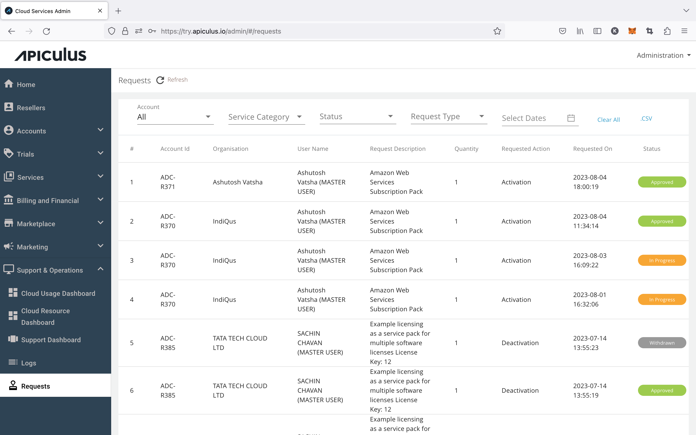

# Handling Purchase and Provisioning Requests

Apiculus ships with the option to configure an 'approval mechanism' on Services in the Catalogue(s). For all Services that require an approval from the admin, a 'request' is generated upon initiating purchase. Admins are notified of these requests via email, and can be accessed from **Support & Operations > Requests** from the main navigation menu.

The list of requests can be filtered and downloaded as a _.csv_ file. Request approval and rejection may have subsequent input required as part of the respective Service configuration. End customers are always notified of request approvals and rejections.