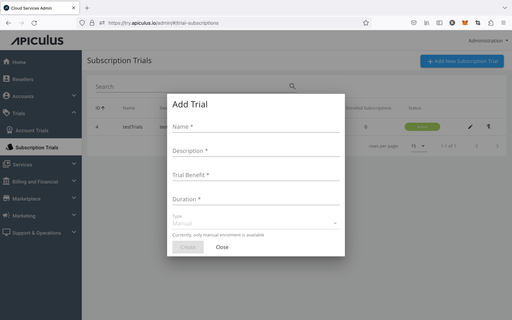

# Working with Subscription Trials

## Creating a New Subscription Trial Programme

To create a new subscription trial programme, click on **+ ADD NEW SUBSCRIPTION TRIAL** and enter the below-mentioned details.

- _Name of the programme-_ Specify the name of the subscription trial.
- _Description-_ You can add details or explanations about the subscription trial.
- _Trial Benefit_- Discount % is offered to the account that will enrol in this particular trial programme.
- _Duration_ -This is the time of the trial programme; Admins need to specify the days.

To create the trial programme click on the CREATE button.

## Enrolling Subscriptions to Trial Programme

To add a subscription to the created subscription trial Programme, click on the edit button to go inside the trial programme.

**_Subscription trial programme> Edit> Subscriptions> +Add subscriptions >select eligible subscription> Click on CONFIRM> Select Yes to pop over message_**

_**Note** - a subscription needs to be created first before getting added to a subscription trial._

## Updating Subscription Enrollments

Subscription enrollments can be updated in the same manner as [updating account trial enrollments](WorkingwithAccountTrials).