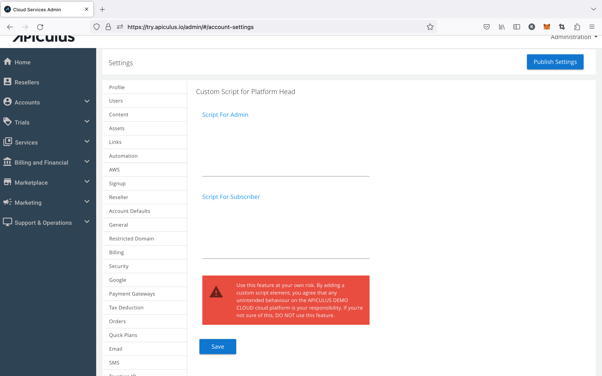

# Adding Custom Scripts

Apiculus supports adding custom `` tags.
:::

:::warning 
This is an experimental feature and may end up breaking the platform UI if used incorrectly. **Use this feature with utmost caution**.
:::