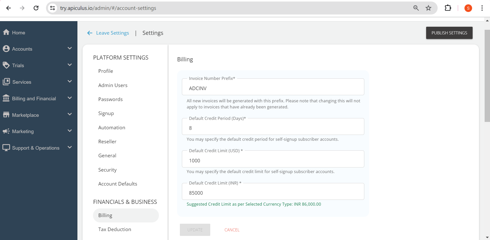

# Configuring Basic Billing

All the various settings related to the billing can be configured here by the service providers. These options are listed in detail below:

1. Invoice Number Prefix: _All the invoices will be generated with this specified prefix. Changing the prefix here will not apply to the already generated invoices; this will apply to the newer invoices._
2. Default Credit Limit:  _This is the credit limit that will be assigned to all the self-signed up_ _subscriber accounts._
3. Default Credit Period: _This is the default credit period that will apply to all self-signed up subscriber accounts._

_Billing operations can be performed in detail for individual accounts via the Subscriber Account Management features._