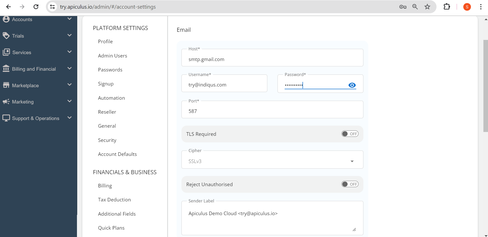

# Configuring System Emails using SMTP

Apiculus CloudConsole is the topmost layer on a technology stack that is fine-tuned and Apiculus delivers all system-generated emails, messages and notifications using SMTP. Any valid email address can be set up as the system email sender using standard SMTP settings.

The configuration can be accessed by navigating to **Settings > Marketing & Communications > Email** from the user menu on the top right of the Apiculus admin console.

