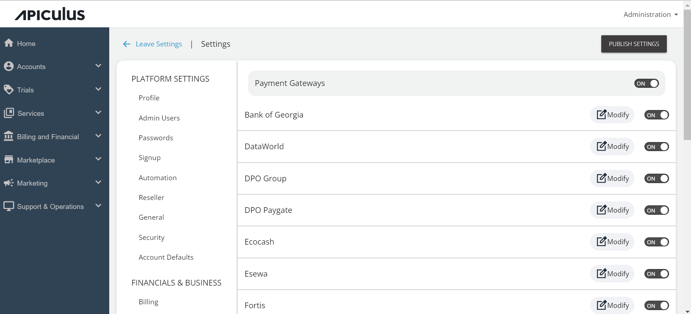
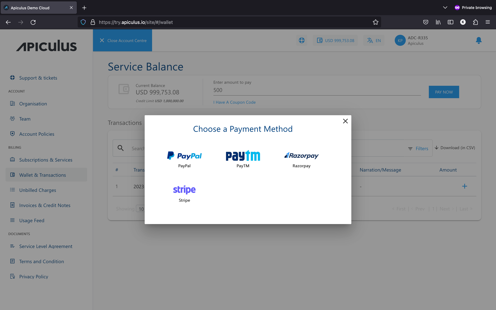

# Managing Payment Gateways

Apiculus admin console allows service providers to use any of the available payment gateways to receive payments in their preferred currency. Payments is an in-built app that allows one or more payment gateways to be enabled if the service provider wishes to offer multiple options to their subscriber users.

## Enabling and Disabling Payment Gateways

To enable a payment gateway from the list of available gateways, navigate to **Settings >Financials & Business > Payment Gateways** from the user menu on the top right in the admin console. By default the payment gateway switch will be disabled. Once enabled, the available options will get enabled and can be selectively switched ON or OFF.

:::note
Apiculus only supports payment gateways as integrations. Obtaining the correct credentials is the service provider's responsibility.
:::

The subscriber users will see a list of all enabled gateways to choose from.

