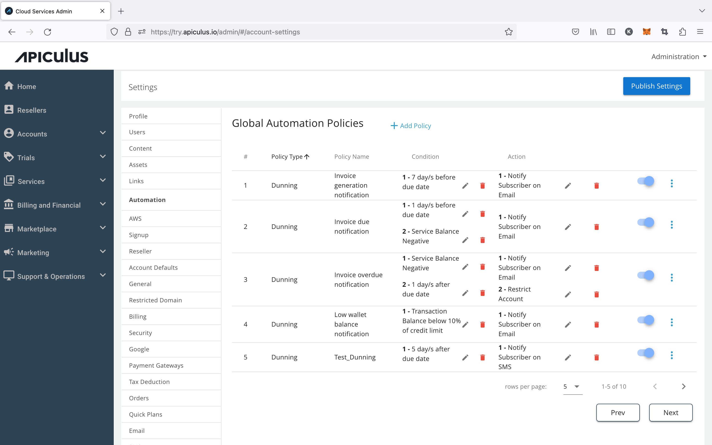
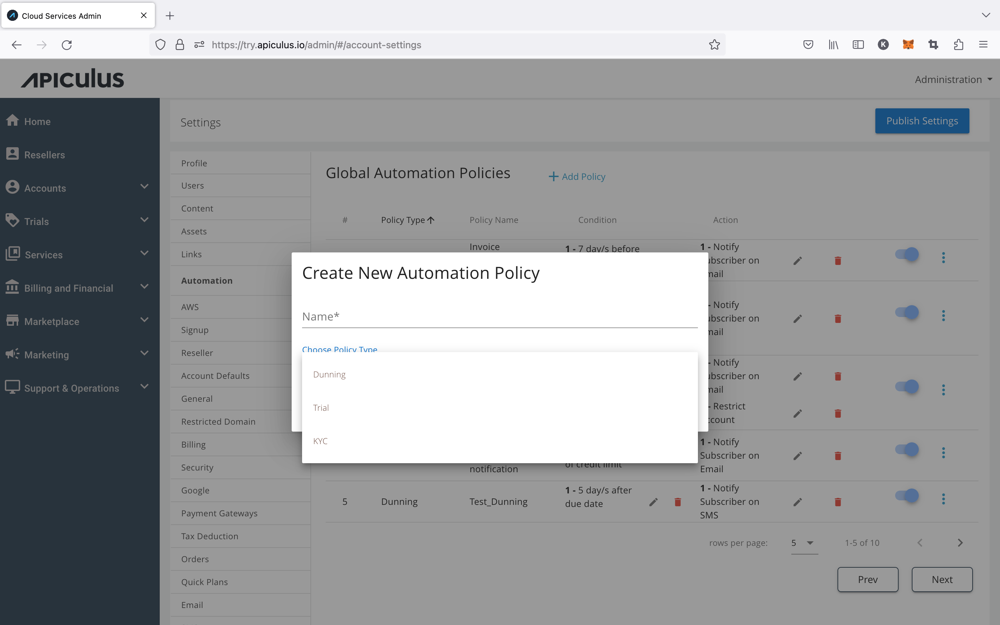
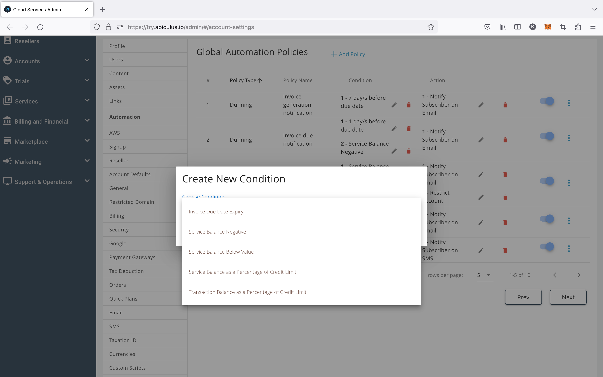
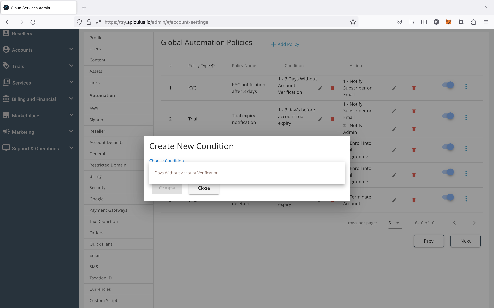
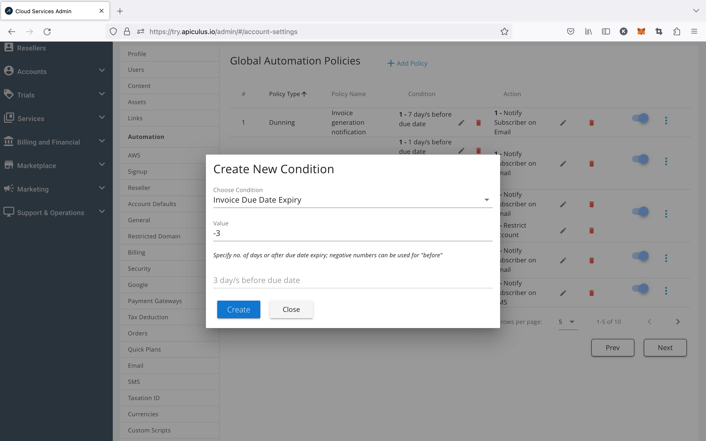
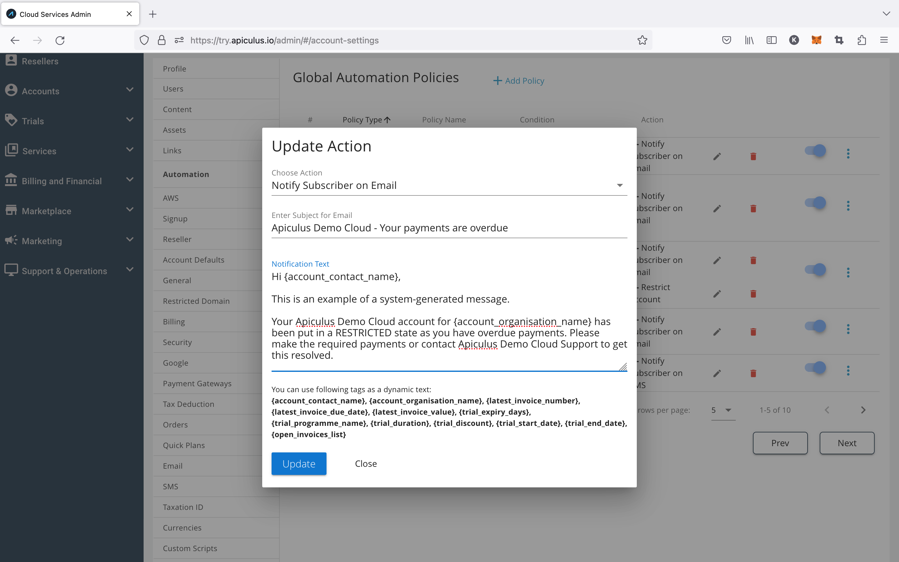

# Configuring Automation Policies

Apiculus allows service providers to define automation policies and workflows to handle scenarios around invoice reminders, non-payments, and customer identity verification.

## Creating an Automation Policy

Account actions can be automated by creating automation policies that trigger an action based on a trigger condition. These policies can be created globally, which are applied to all new subscriber accounts and can also be overridden for individual accounts.

For creating a new policy, click on +Add Policy, then a dialogue box will open up, enter the name for the policy, select the policy type and click on Create.

Once the policy is created, the admin must add the condition and desired trigger to this created policy.

## Configuring Condition Triggers

For the desired automation policy, click on + Add Condition and select a condition from the list of requirements. Various Policy types, conditions, and actions are listed below.

#### Policy Types

- _Dunning_
- _Trial_
- _KYC_
- _Legacy_

**Condition**: _This is the condition on which the action is triggered_

**Dunning Conditions**

- _Due date expiry of an invoice_
- _No. of days without account verification_
- _Negative service balance or service balance below a fixed value_
- _Service balance going below a percentage of the credit limit_
- _Transaction balance going below a percentage of the credit limit_

_

**KYC Conditions**

- _No. of days without account verification_

_

**Trial Conditions**

- _Account Trial Period Beginning_
- _Account Trial Period Expiry_
- _Subscription Trial Period Beginning_
- _Subscription Trial Period Expiry_
- _Expiry of Selected Trial Programme_
- _On Account Creation (self-sign up or admin-assisted accounts)_

_

_Example of a configured **dunning** condition trigger that checks for **3 days before invoice due date.**_

---

## Configuring Automation Actions

For adding action, click on the + Add Action.

**Action-** _These are the actions that are triggered based on the condition_

- _Notification (email or SMS)_
- _Restriction from new purchases_
- _Suspension of accounts_
- _Termination and deletion of all resources_
- _Enroll into Trial Programme_

_

For notification actions, smart tags can be used to insert dynamic data in the email or SMS. Smart tags currently available are:

1. _Primary contact name_
2. _Organisation name_
3. _Latest invoice number_
4. _Latest invoice due date_
5. _Latest invoice due amount_
6. _Days to trial expiry_
7. _Trial programme name_
8. _Trial duration_
9. _Trial discount/benefits_
10. _Trial start and end dates_
11. _List of open invoices_

_---_

_Example of a **notification by email** action using **smart tags**._

