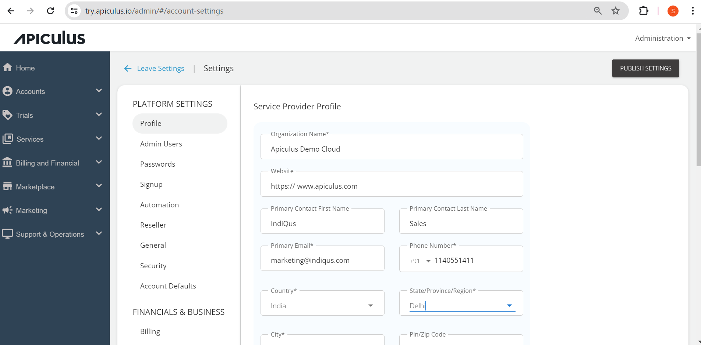

# Managing Service Provider (SP) Profile

The profile consists of all the service provider details; admins can configure all the details straight from the name of the cloud they will offer as to the address. The profile details are given below:

1. **Name-** _The name of the cloud by which service providers want to deliver the services in the market_.
2. **Primary Contact name-** _Enter the service provider’s contact person’s name._
3. **Primary Email-** _Specify the service provider’s email address._
4. **Website-** _Specify the URL of the website._
5. **Primary Address-** _Enter the service provider’s address and the Zip code._
6. **Other Phone(s)-** _Enter the service provider’s contact number(s)._
