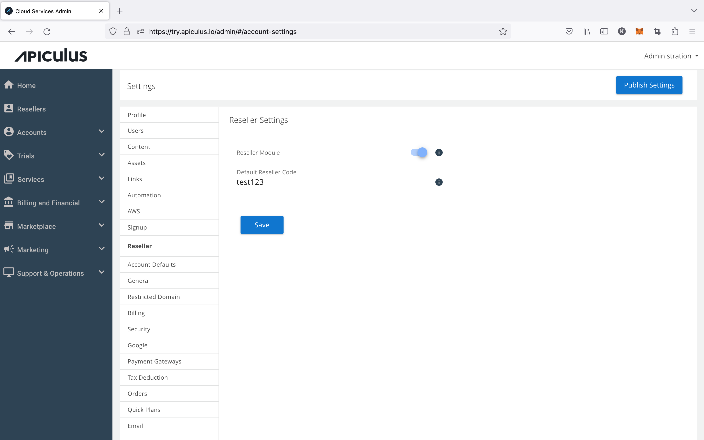

# Enabling Reseller Module

Apiculus ships with an experimental Reseller Module which allows service providers to onboard subscribers/customers via a reseller partner. This is a limited-functionality partner module which enables the following:

1. Adding resellers to the system and assigning unique 'reseller codes' to each;
2. End customer signup using a valid reseller code to associate the account with the corresponding reseller;
3. Viewing basic reports for reseller-tagged accounts.

To enable the reseller module, navigate to **Settings > Reseller** and switch the setting to ON. The  'default reseller code' can be left blank to associate all signups directly with the service provider, or  any existing/available reseller code (active reseller on the system) be used as default.

:::note
Switching this module ON will enable the Resellers menu item in the main navigation menu.
:::

:::note
This will not change anything on the end customer/subscriber experience.
:::