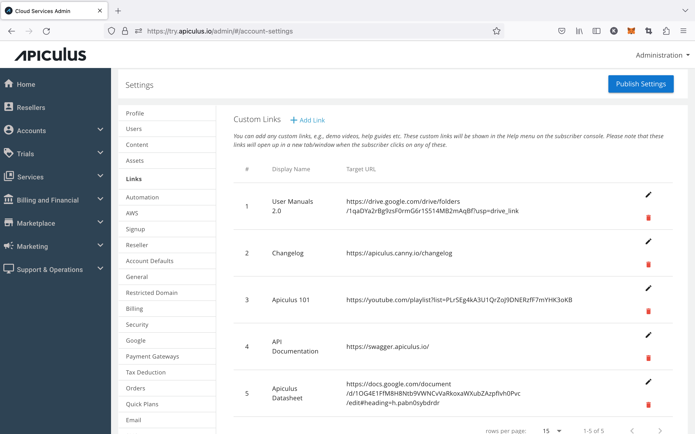

# Configuring Custom Links

Service providers can add custom links, e.g., demo videos, help guides, etc. These custom links will be shown in the Help menu on the subscriber console. Please note that these links will open up in a new tab/window when the subscriber clicks on them. Navigate to **Links** under settings and click on the **Add New** button. The dialogue box opens up, and you need to provide the **Display Name** for the link and the **Target URL**.

