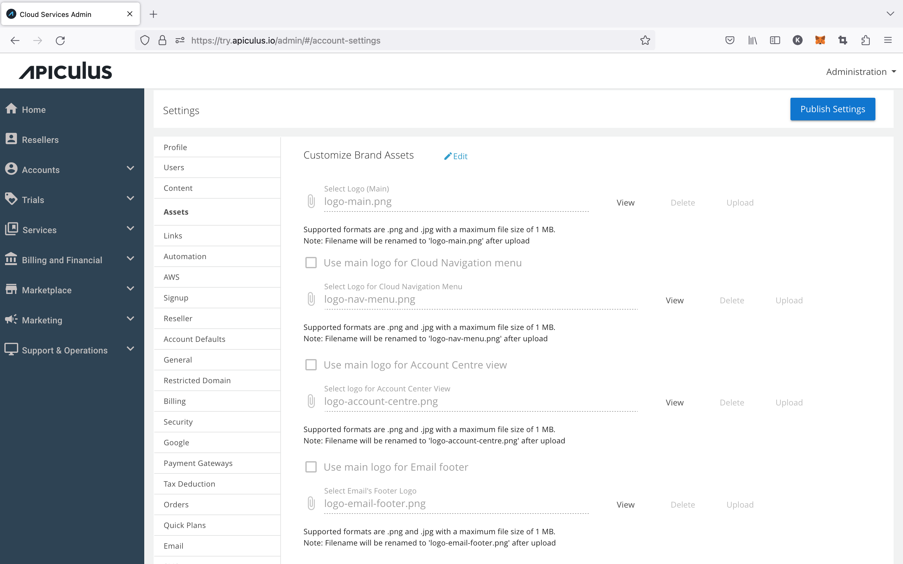
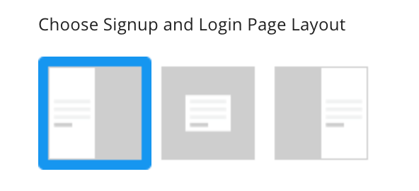

# Customising Brand and Graphic Assets

Service providers can use this to customize their cloud as per their branding; 100% white labeling is possible. So right from the logo, fonts to the email footer are easily configurable from the assets section. Details are mentioned below:

### Logo

Service providers can view and delete the existing logo and upload it as per their branding requirements. Click on the edit button beside Customize Brand assets and then upload the logo. At the time of uploading the logo, alternate versions (for Account Centre display) can also be defined, if preferred.

### Favicon

Service providers can view and delete the existing logo and upload it as per their branding requirements. Click on the edit button beside Customize Brand assets and then upload the Favicon.

### Banner

Service providers can view and delete the existing Banner and upload it as per their branding requirements. Click on the edit button beside Customize Brand assets and then upload the Banner. At the time of uploading, the signup/login page layout can also be defined. The supported layouts are:

|                                                                                                                          |                             |
| ------------------------------------------------------------------------------------------------------------------------ | --------------------------- |
| > Banner on left; form on right   > Form on left; banner on right ** ** > Form in centre; banner as background |  |

### Email Footer’s Logo

Service providers can view and delete the existing Email Footer logo and upload it as per their branding requirements. Click on the edit button beside Customize Brand assets and then upload the Email Footer’s logo.

### Theme

Service providers can download and upload the existing theme file per their branding requirements. Click on the edit button beside Customize Brand assets and then upload the Theme. This will download the theme customisation kit in _.css_ format which can be edited and re-uploaded.

The theme customisation kit can be used to define:

- Brand colour palette (primary, secondary and tertiary colours)
- Standard colour palette (red, green, blue, orange etc.)
- Greyscale colour pallette (white/0%, 5%, 25%, 50%, 75%, 95% and black/100% greys)
- Navigation panel colour palette
- Login/signup page colour palette

### Font

Service providers can download the existing font file and upload it as per their branding requirements. Click on the edit button beside Customize Brand assets and then upload the font file. The system supports .woff files for fonts.

:::note
The correct font licenses should be procured by the service provider.
:::