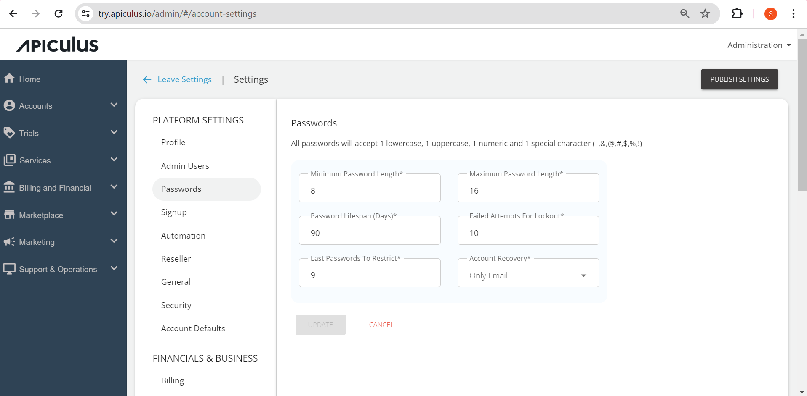

# Configuring Password Policies
Apiculus platform admins can set up password policies from **Settings >Platform Settings > Passwords**. A host of controls is available to set up password policies, including:

- Password length (min and max)
- Password lifespan (days after which password needs to be reset)
- Lockout attempts (failed attempts after which the account should be locked out)
- Rotation (last-used passwords that can not be reused)
- Recovery mode (email and mobile, mobile available if SMS gateway is set up)

:::note 
All passwords will accept at least one lowercase, one uppercase, one numeric, and one special character (_, &, @, #, $, %, or !).
:::