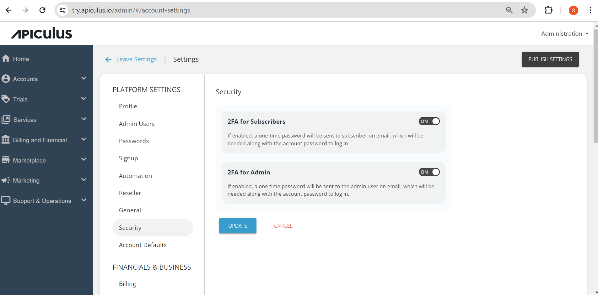

# Login Security and 2FA

Service providers can set up two-factor authentication (2FA) for subscribers and admins separately. If selected, a one-time password (OTP) will be sent via email to the user who is attempting to log in. Additionally, if an SMS gateway is enabled and configured, the OTP will also be sent to the user's registered mobile phone.

