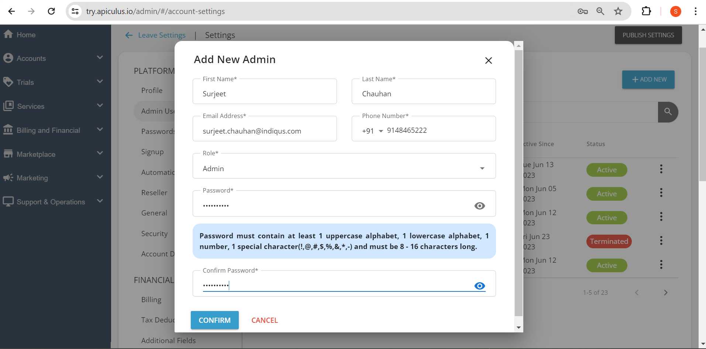

# Managing SP Admin Users

The **Settings > Users** section will list down all the administrators with their roles. In addition, specific SP teams can be onboarded with restricted administrative access using [SP admin RBAC](/docs/AboutServiceProviderAdministration/Role-basedAccessonAdminConsole). RBAC is a highly flexible access management system that can be configured differently for each service provider. Service providers can specify the actions allowed for different user types, and the entire setup can be configured accordingly.

The user’s list will have the following details:

- **Admin ID** - The ID associated with an account.
- **Admin Details** - This displays the name and email ID associated with the account.
- **Roles** - This specifies the role associated with an account.
- **Active Since-** -Day and date of the account creation.
- **Status** - This shows the present status of the particular administrator user. It can be active or terminated.
- **Edit option** - A pencil icon is available to edit the user’s information and update it accordingly.
- **Delete** - The delete button is available to delete the user.

## Creating Users

For creating administrative users, admins need to click on the + Add Another button, and a dialogue box opens; the essential information needs to be entered.

Once the information is filled up, and the password is set up as per the instructions mentioned in the dialogue box, the admins need to click on the **Create** button.