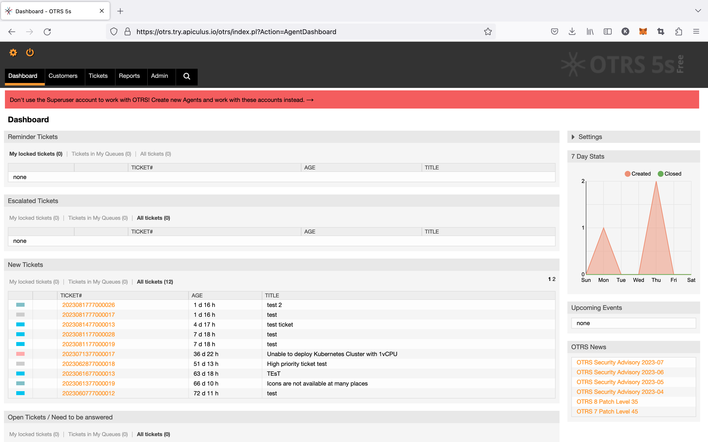

# OTRS Ticketing and Service Interface

ApiculusApiculus admin console allows for [end-to-end service management via tickets](https://docs.apiculus.com/hc/en-in/articles/12997416195101) using OTRS Community Edition. Service providers get agent and admin access to OTRS for being able to onboard their helpdesk teams and configure workflows as required.

