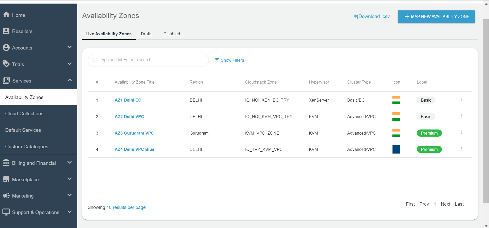
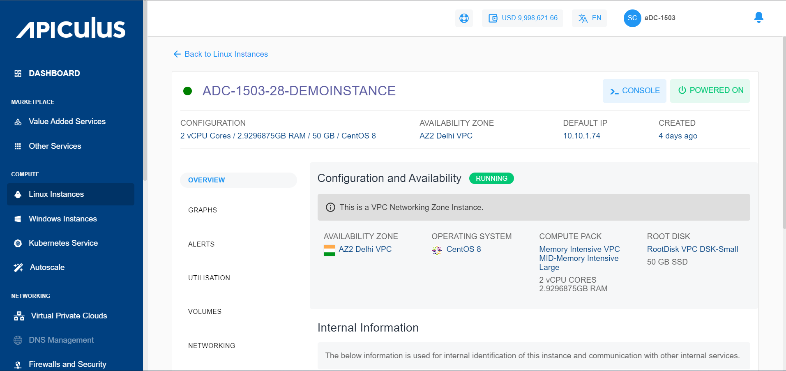
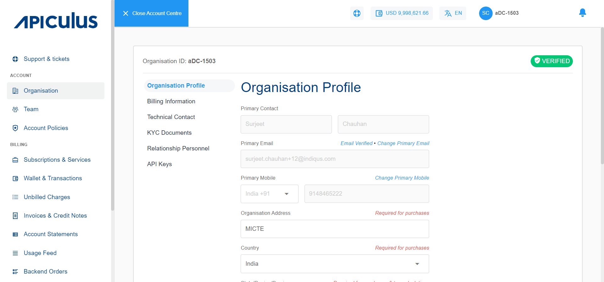
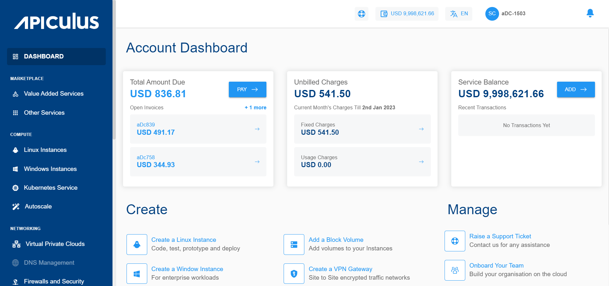
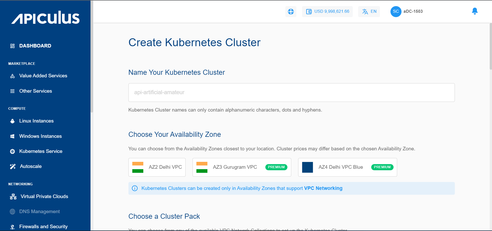
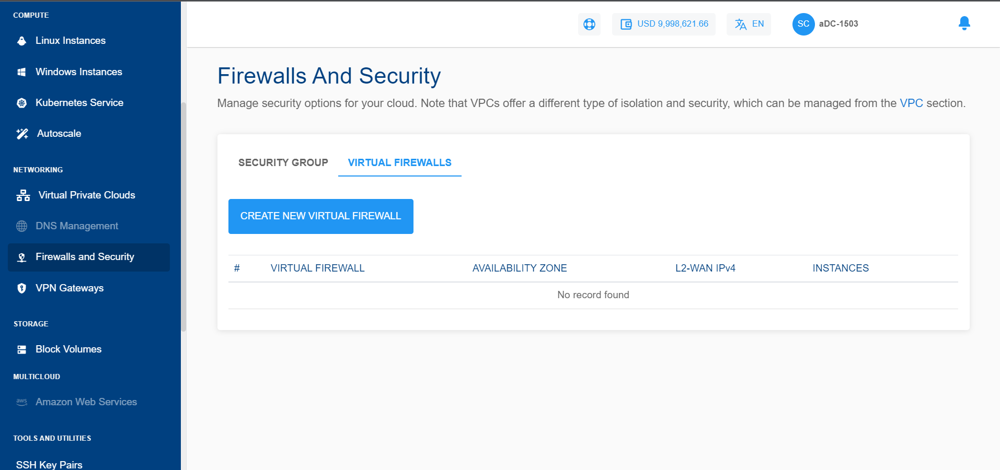

# Version 2.0.0.0
```
Date: 06.01.2023
Type: Major
```

## About this Release

This is a major release that introduces a completely new face (and phase) for Apiculus. With this version - now known as Apiculus CloudConsole - we're bringing a brand new UX with awesome new features! The all new Apiculus CloudConsole focuses on simplicity and give the users a great feel with an excellent and delightful Apiculus experience. We have also trimmed the fat and removed what was not needed.

## Completely NEW: Service Management Gets Newer and More Capable

Apiculus has introduced a completely new way of managing cloud Services. You can add Availability Zones, create Cloud Collections, create Custom Catalogues, or simply manage Default Services - all by yourself using the Admin Console. You can now quickly define which services to offer, from where to offer and what price to offer, and even if a specific set of customers need to cater in a different catalogue; this all can be done from the admin UI in a simple, efficient and quick manner.

The services section consists of the below four major sub-sections:

- Availability Zones
- Cloud Collections
- Default Services
- Custom Catalogues



## Completely NEW: Subscriber Interface is New and Refreshed

The Apiculus subscriber experience is now delivered via an entirely new UI with a simple and intuitive UX that helps the user to do everything on the cloud portal seamlessly and effortlessly. This is not all - we'll be constantly upping the game in order to create delightful experiences, and this is only the beginning.



## Completely NEW: Account Centre

The business end of the interface has now been separated from the day-to-day operational end in order to create a more focused experience for the end users. The Account Centre has been introduced as a single complete view where all information regarding the organisation, billing, invoices, account policies, tickets and other useful links can be viewed and accessed. Users can very easily switch back and forth between the Account Centre and cloud views, thus making the focus that much easier to achieve.



## Refresh: Onboarding & Dashboarding Experience

Signing up as an end user is now a completely new process that does away with long form fills. Just start with the bare minimum details and you're good to go. We want your customers to feel zero friction in signing up for your cloud, and we have taken all measures to ensure that. The Dashboard has also been simplified and decluttered, and now focuses only on the most important bit of information that any organisation needs to know - what they're spending.



## Refresh: Apiculus Kubernetes Service

Apiculus Kubernetes service has also received a complete refresh as we've replaced the K3s+Rancher combination with CloudStack's native Kubernetes service (CKS). This also helps us deliver features like high availability clusters, cluster scaling options, root disk sizing, reusability of Compute offerings, better support for CSI and CNI plugins, cluster dashboard and much more.



## Refresh: Virtual Firewall

Virtual Firewall gets a new flow and an easier way of activating the service. Apiculus now supports FortiGate VM in addition to pfSense to deliver the virtual firewall appliances. While currently limited to a choice between the two, this gives you an option to strategise between offering an open-source appliance and owning the support, or offering a supported appliance altogether. Apiculus uses L2 networks for this service, which work in a manner similar to the VR-based VPC service.



## What’s Removed

A lot of legacy components have been removed. The significant ones that you'll notice on the new UI are:

- Compute & Storage and Network Services - since these services now have their own dedicated sections on the UI, we felt no need to keep these options and, hence, have done away with them. We'll soon we removing the Value Added Services marketplace as well.
- Welcome Tour - we believe we can never match up to the options and capabilities that are provided by Digital Adoption Platforms (DAP). Hence, to make way for DAPs, which can be connected using our killer Google Tag Manager integration, we've opened up the plate for you and given you the choice to customise how you wish your customers to be onboarded and taken through the platform. After all, it's your cloud!

## Enhancements and Fixes

- More layout options added for the Welcome page
- Options added for displaying different logos at different places (main navigation, email, Account Centre etc.)
- Minor bug fixes

:::note
We have a lot more that's coming your way in 2023 and we couldn't be more excited to share these announcements. But, all in due time :)
:::