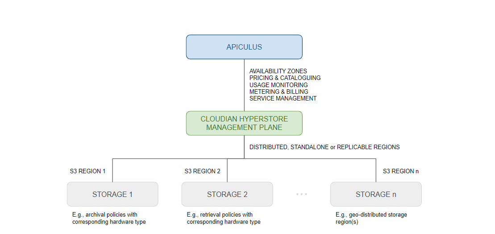

# About Apiculus Object Storage

Apiculus Object Storage (AS3) provides scalable and flexible storage for unstructured data in the form of objects. In object storage, data is stored as discrete objects containing data, metadata, and a unique identifier. Apiculus delivers the service as an integration with Cloudian HyperStore.

:::note
The following are not yet supported on AS3:
- _**Glacier support** - Archival storage using Glacier is not yet available._
:::