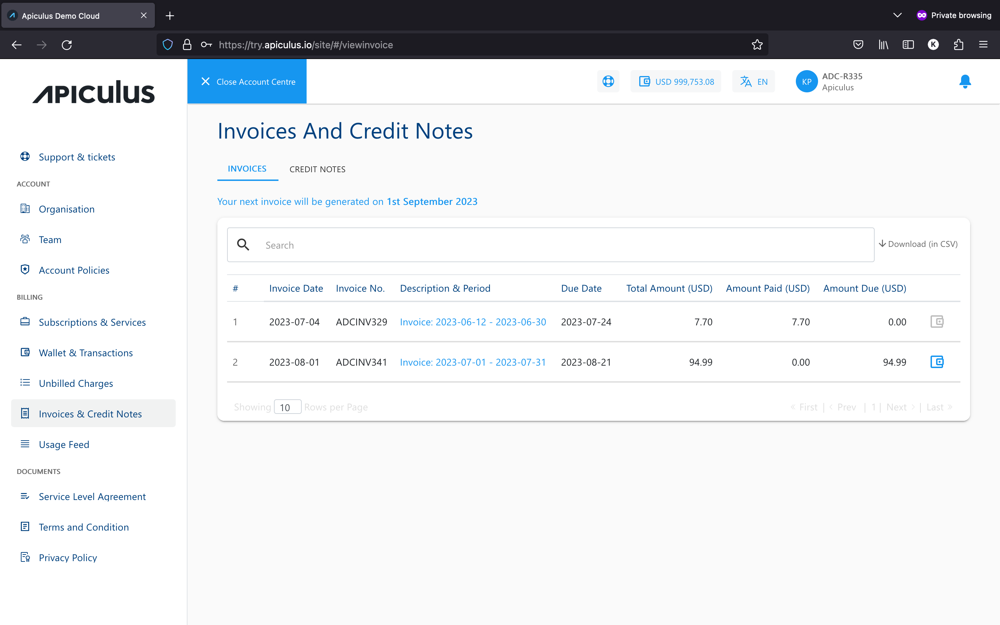

# Invoices and Credit Notes
Invoices are generated at the end of each billing cycle for the services consumed during the billing cycle. Invoices can be accessed from the **Billing > Invoices & Credit Notes** section on the main navigation panel.

If Apiculus Cloud takes online payments, then payments against individual invoices can be made by clicking on the wallet/payment icon next to the invoice. Doing so will navigate to the payment gateway page, where you can use any of the supported modes of payment.

:::note
Apiculus Cloud does not store any card or bank account information, and the same is handled solely by the payment gateway provider.
:::