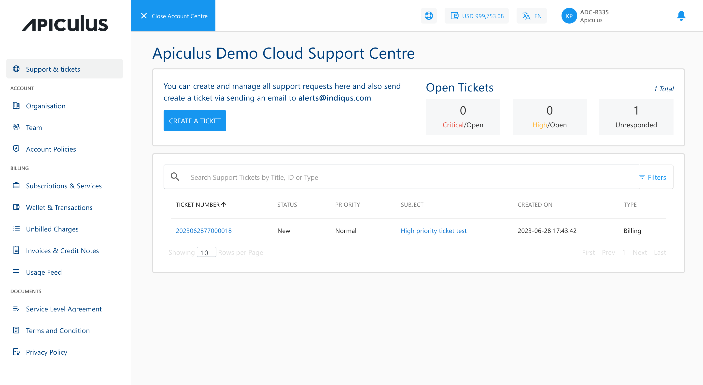

# About Apiculus Account Centre

Account Centre on Apiculus CloudConsole is the non-technical (commercial and support) dashboard that can be used for viewing and managing all non-technical aspects of your Apiculus Cloud account. The Account Centre can be accessed by clicking on any item in the user menu on the top-right, on the help/support icon in the header, or on the wallet icon in the header.

Apiculus CloudConsole offers a one-click view switcher between Account Centre and the Cloud Dashboard.