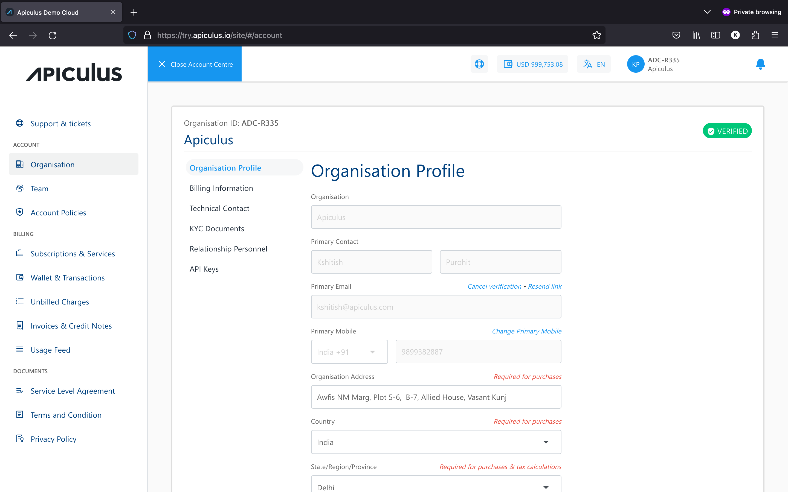
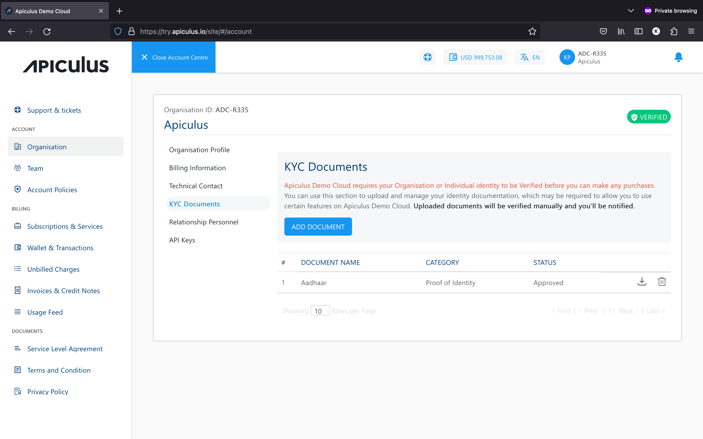

# Organisation/Account Profile

Using the **Profile** section, you can manage your organisation account profile on Apiculus Cloud. The profile management section can be accessed from Account Centre from the top helper bar by clicking on the organisation. Account profiles include the following:

1. **Details -** These are the basic demographic details of your organisation. All editable fields can be updated at any time.
2. **Billing Information -** These are the billing details for your organisation, viz., billing address, taxation ID, etc.
3. **Technical Contact -** These are the details for billing and technical contacts in your organisation. 
	:::note 
	These contacts are not child users and do not get login credentials.
	:::
4. **KYC Documents -** This section can be used to upload various organisational documents, e.g., company registration information, taxation ID documents, proofs of address, etc. 
	:::note 
	Apiculus might require these documents to allow continued usage of the cloud services.
	:::
5. **Relationship Personnel -** This section will show the point of contact details that have been assigned to your account by the service provider.

