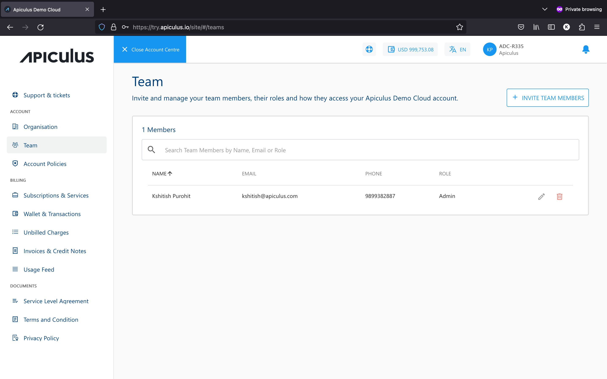
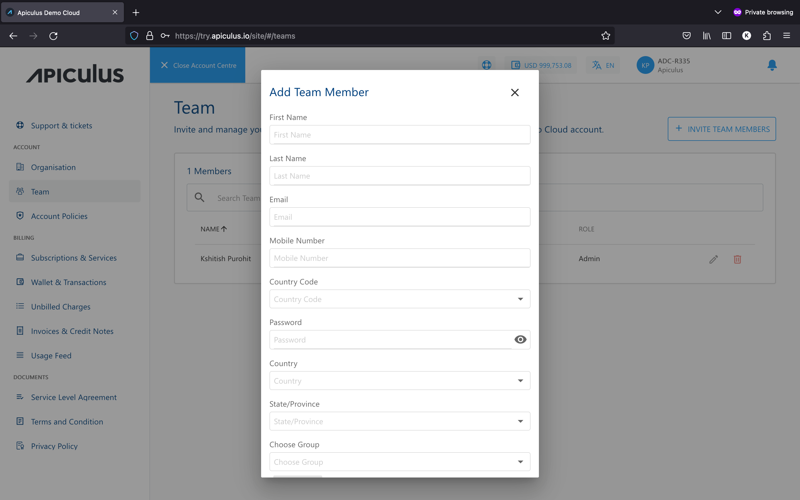

# Team and Child User Management

Team members or child users can be onboarded using the **TEAM** section from the account centre. Apiculus Cloud allows you to add billing, technical, or other admin users who can log in to your account and perform operations.

To add a child user, click on the **+ADD TEAM MEMBERS** button on the top right. This will open up a dialog box with the following information requirements:

- **User Details -** name, email, country, phone number, etc., for the child user.
- **Password -** a password to begin with. Please note that the child user can reset the password from the Apiculus CloudConsole.
- **Group -** the role for the child user. These can be:
    - **Admin -** gets access to all functionalities.
    - **Billing -** gets permissions to perform billing actions and read-only for other actions.
    - **Technical -** gets permissions to perform technical actions and read-only for other actions.

The child user will get notified over the email provided in the form of their account being created. They can then login and use the Apiculus CloudConsole based on the role assigned to them.

:::note
The first/default user will supersede all other admin users, which means that while admin users can edit or remove other users, only the default user can delete other admin users.
:::