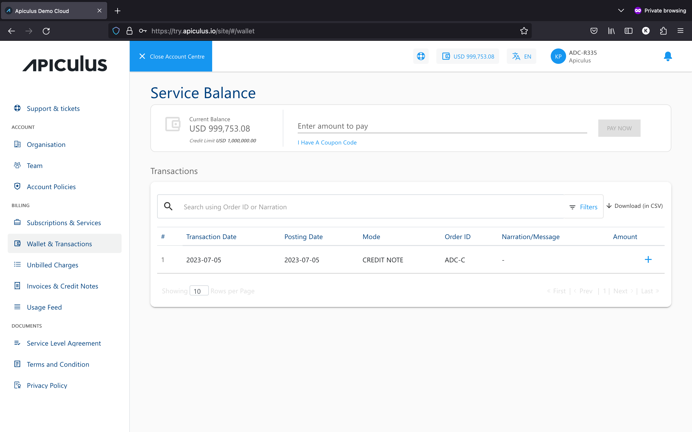

# Wallet and Transactions
For all practical purposes, the service balance acts as your wallet balance or purchase capacity at any given point in time. The service balance is an aggregation of your credit limit, total payments made and the total charges incurred on your account. Your service balance is always displayed on the top bar and gets updated in real-time when a transaction or a charge is recorded.

The service balance and transactions listing on the main navigation panel can also be accessed from the **Billing > Wallet & Transactions** section. This section lists all the transactions that have been made towards your service balance, along with providing a means to add money to your wallet.

