# Creating Autoscale Groups

1. Go to **Compute > Autoscale Groups** in the navigation menu.
2. Click on the **"NEW AUTOSCALE GROUP"** located at the center of the page.
3. Select an **Instance Category. 
	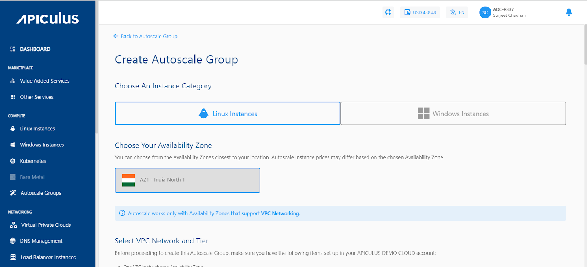
1. Choose an **Availability Zone** that represents the geographic region for the deployment of your Autoscaled Instance.
2. From the dropdown menus, pick a VPC network under "**Select VPC Network**," choose the appropriate tier in "**Select a Network Tier**," and then select a load balancer from the options in the **"Select Load Balancer"** dropdown
3. Choose an **OS Image** to be run on your Instance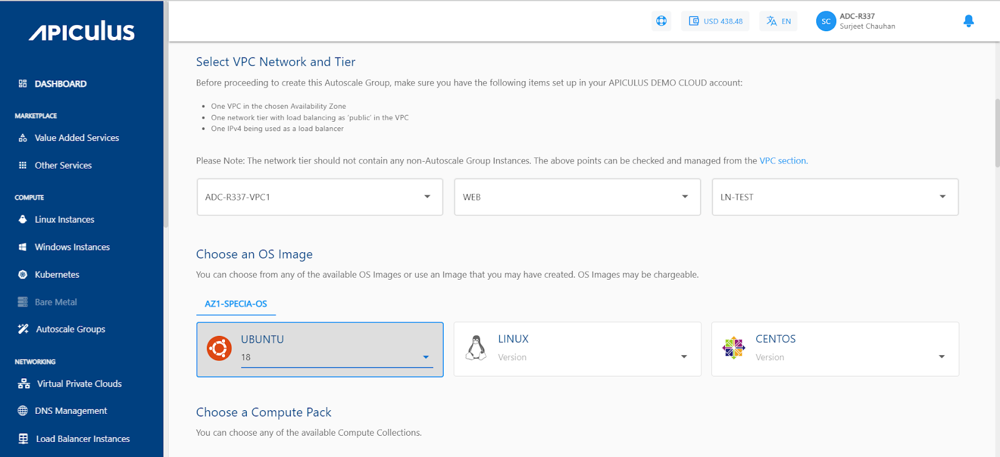
4. Choose a **Compute pack** from the available compute collections.
5.   Choose a **Root disk** from the available Disk packs, or alternatively, use the free size option to define the size of the Root Disk.
6. Now, Configure the **Autoscale group** as per your requirement; the options below need to be specified.

- - _**Min. Group Limit:** This is the minimum number of members in the Autoscale Group. The number of instances in the group will be equal to or more than this number._
    - _**Max. Group Limit:** This is the maximum number of members in the Autoscale Group. The number of instances in the group will be equal to or more than this number._
    - _**Expunge VM grace period:** This defines how long before a scale-down is executed should the app/user connections to an Instance be removed._
    - _**Polling Interval:** This defines at what interval should the Autoscale Group check your policy conditions and execute the relevant Scale or Scale-down configurations.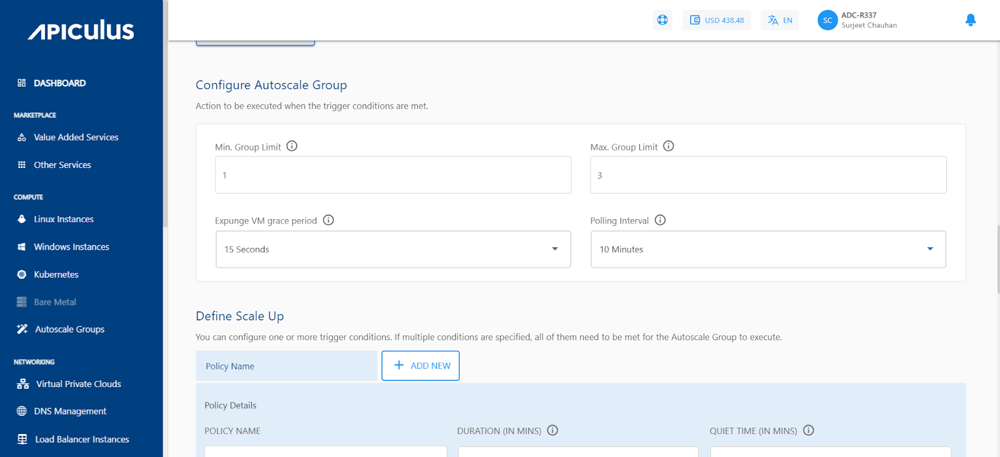_

  10.  Next is to define the **Scale Up policy** (Multiple policies can be configured; if multiple conditions are specified, all of them need to be met for the Autoscale Group to execute). You need to specify the following:

- **_Policy Name_**
- _**Duration (in mins):** This is the duration in which the conditions have to be true before action is taken._
- _**Quiet Time (in mins):** The cool-down period in which the policy should not be evaluated after the action has been taken._
- _**Parameter:** Name of the counter for which the policy will be evaluated._
    - Parameters: The performance parameters expose the state of the monitored Instances. As of now, there are five new parameters to work with that feature:
        
    - _Instance CPU - average percentage._
        
    - _Instance Memory - average percentage._
        
    - _Public Network - mbps received per Instance._
        
    - _Public Network - mbps transmit per Instance._
        
    - _Load Balancer - average connections per Instance_.
        
- _**Breach:** Relational Operator to be used with threshold. This will be Greater Than by default._
- _**Threshold:** This is the value for which the Counter will be evaluated with the Operator selected.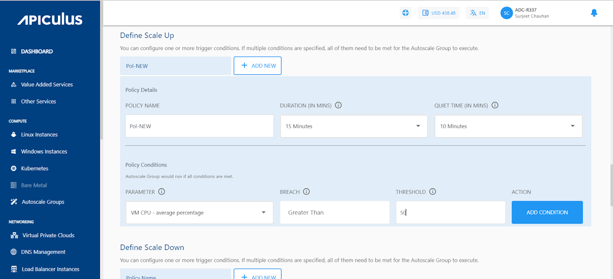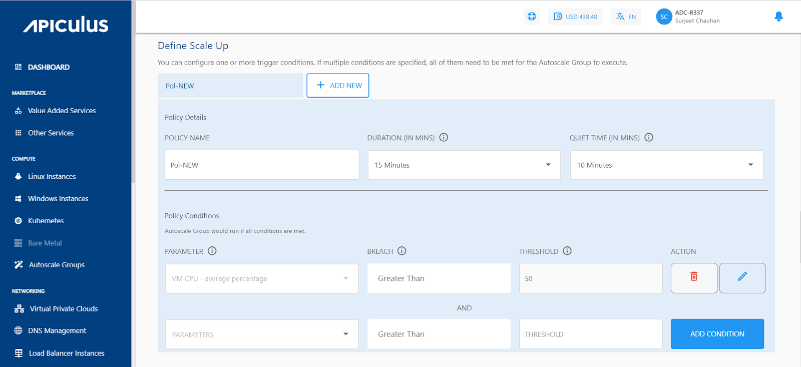_

11. Then click on the  **ADD CONDITION** to add the policy. If you want to add more policies, click on the **+ ADD NEW** button present beside the Policy name.

12. Then, Define the **Scale Down Policy**; the parameters are similar to the Scale UP policy. Only the _breach parameter will be greater_ than by default.

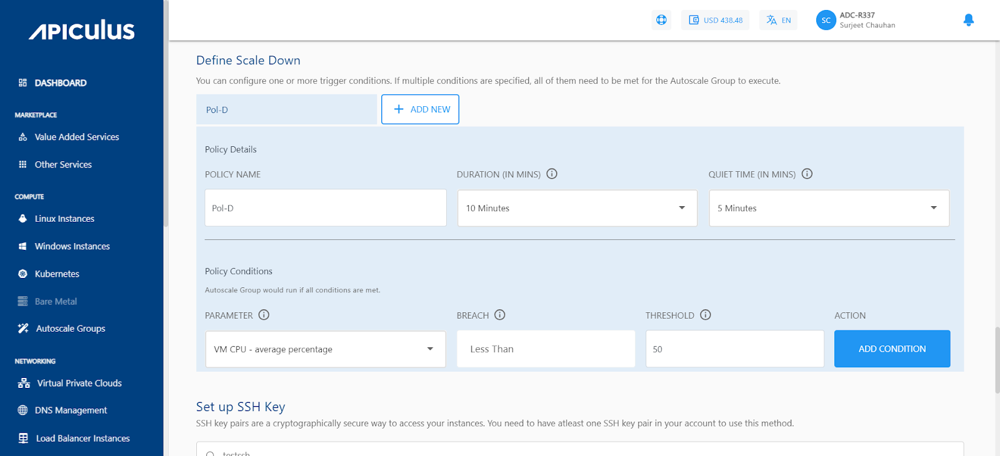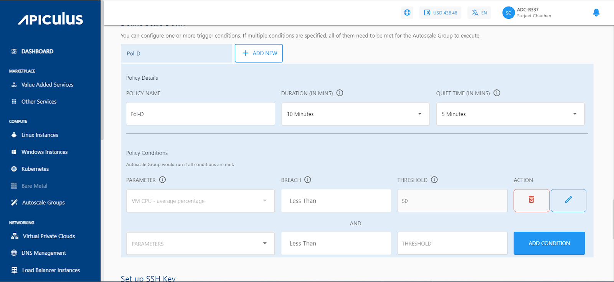

13. Next is to set up the SSH Key. if your account doesn’t have any SSH key pair, then you can use the **_Generate a new key pair_** option, and you can also upload the key by selecting _**Upload a key pair**.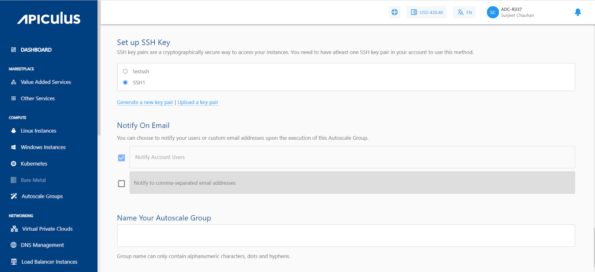_

14. If you want to notify your users or custom email addresses upon the execution of this Autoscale Group, then you can select the appropriate option available under Notify on email. I.e., N_otify to account users, Notify to comma-separated email addresses._

15. Last is to specify the name of your autoscale group. (Use the naming convention mentioned in the helper text below.)

16. Now, click on the **PUBLISH THIS AUTOSCALE GROUP** button for publishing the autoscale group.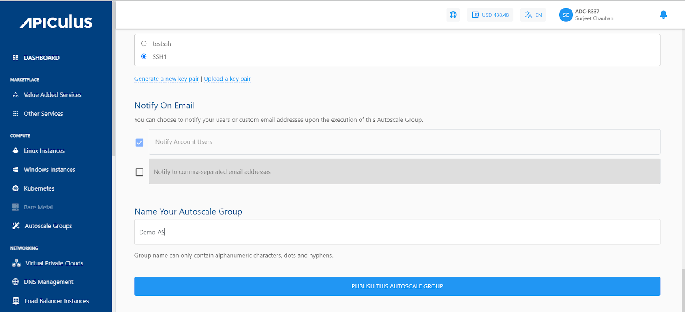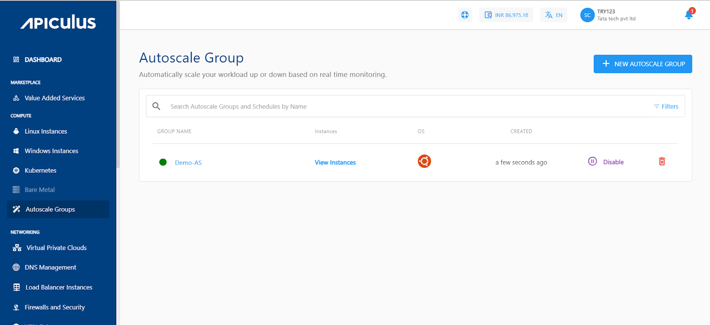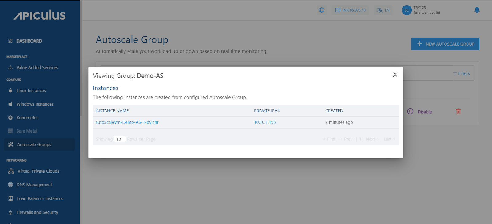