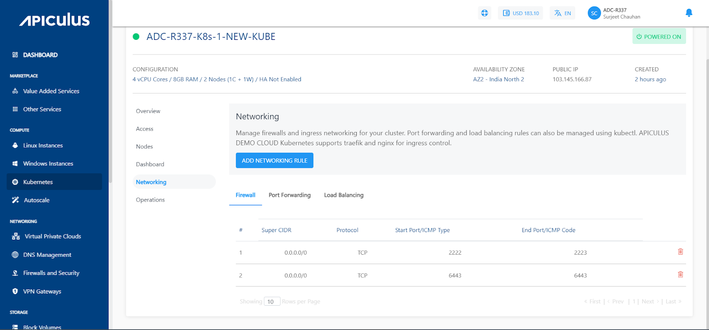
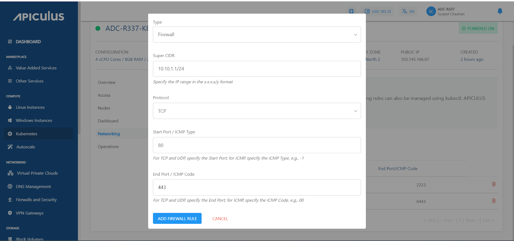
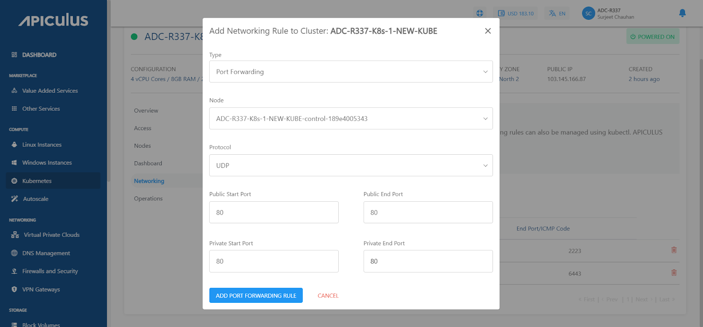
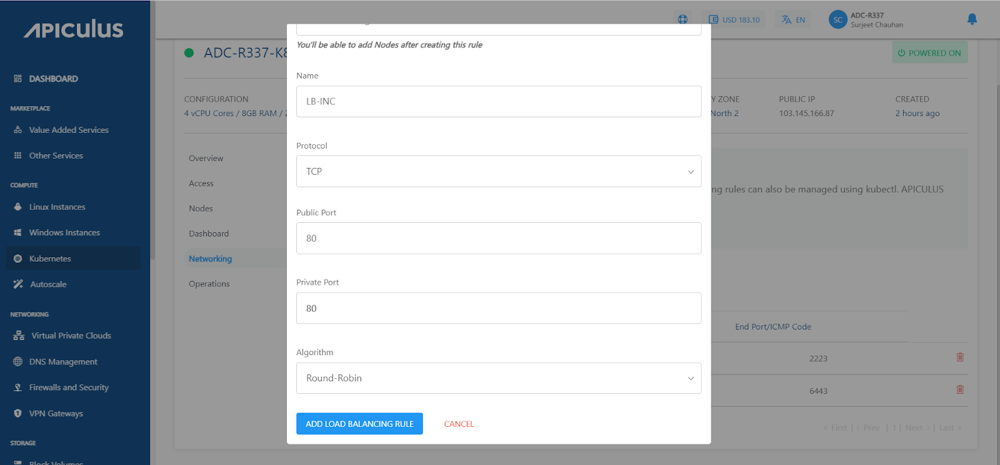

# Ingress Networking on Kubernetes Clusters

This **Networking** section under cluster details helps manage a cluster's firewalls and ingress networking. Port forwarding and load balancing rules can also be managed using kubectl.

:::note
Apiculus Kubernetes Service supports traefik and nginx ingress controllers.
:::

## Adding a Firewall Rule to Cluster

A firewall restricts incoming and outgoing network traffic to enhance the security of Kubernetes clusters. It prevents unauthorised access to the cluster's components and resources.

1. Click the **ADD NETWORKING RULE** button, and a popover will open.
2. Select **Firewall** from the list of networking options and then specify the following options.
    1. Super CIDR (CIDR notation typically consists of an IP address followed by a slash ("/") and a number indicating the number of significant bits in the subnet mask. For example, "192.168.1.0/24" represents a subnet with an IP range from 192.168.1.0 to 192.168.1.255).
    2. Choose a Protocol from the available options, i.e., TCP, UDP & ICMP.
    3. Enter the Start Port.
    4. Enter the End Port.
    5. Click on **ADD FIREWALL RULE.**

## Adding a Port Forwarding Rule to Cluster

Port forwarding allows external traffic to access specific services running within Kubernetes pods, enabling external communication with applications.

1. Click the **ADD NETWORKING RULE** button, and a popover will open.
2. Select **Port Forwarding**  from the list of networking options and then specify the following options.
    1. Select the particular node from the list.
    2. Choose a Protocol from the available options, i.e., TCP, UDP.
    3. Enter the Public Start and End Port.
    4. Enter the Private Start and End Port.
    5. Click on **ADD PORT FORWARDING RULE.**

## Adding a Load Balancing Rule to Cluster

Cluster load balancing rules distribute incoming network traffic across multiple Kubernetes pods to ensure high availability, fault tolerance, and optimal resource utilisation.

1. Click the **ADD NETWORKING RULE* button, and a popover will open._
2. _Select_ **Load Balancing** from the list of networking options and then specify the following options.
    1. Specify the name of the rule.
    2. Choose a Protocol from the available options, i.e., TCP proxy, TCP, and UDP. (The protocol determines how the traffic is transmitted)
    3. Enter the Public Port.
    4. Enter the Private Port.
    5. Select the algorithm.
    6. Click on **ADD LOAD BALANCING RULE**.

