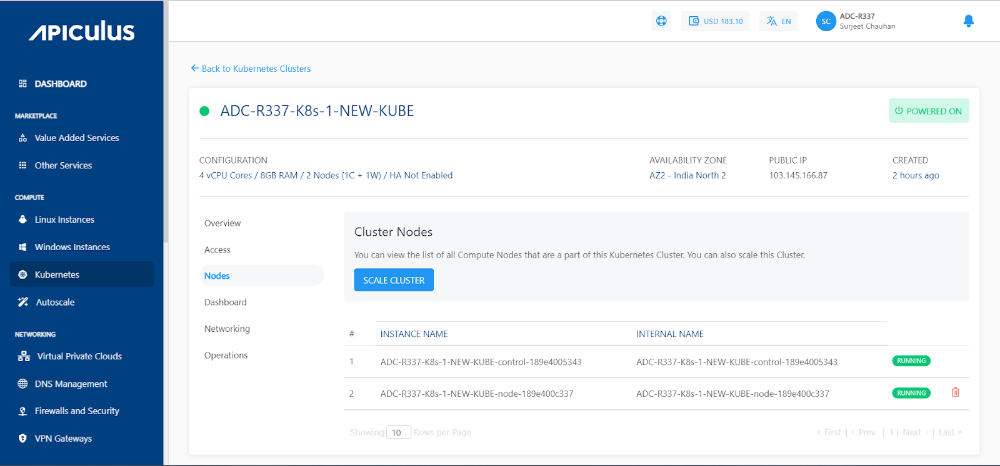
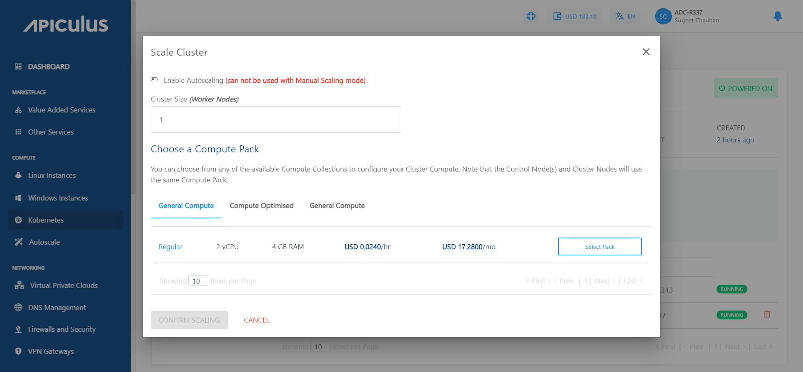
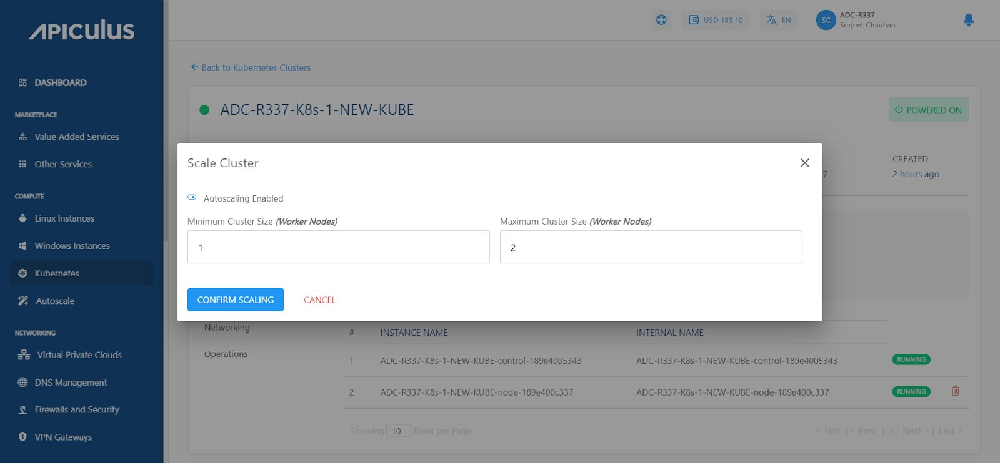

# Scaling Kubernetes Clusters

Apiculus CloudConsole allows for manual and automatic cluster scaling. Clusters scaling can be configured from the **Nodes** section of cluster details or from the **Operations** section of cluster details.
## Manually Scaling a Cluster

- _Under **Nodes** (or under **Operations**), click on_ **_SCALE CLUSTER_**_, and a pop tab will appear; keep 'autoscaling' disabled._
- _Select one of the available compute packs._
- _Click on_ **_CONFIRM SCALING_**_._

## Automatically Scaling a Cluster

- _Under **Nodes** (or under **Operations**), click on_ **_SCALE CLUSTER_**_, and a popover will appear, enable 'autoscaling' by flipping the switch._
- _Enter the minimum and maximum number of worker nodes._ 
- _Click on_ **_CONFIRM SCALING_**_._

