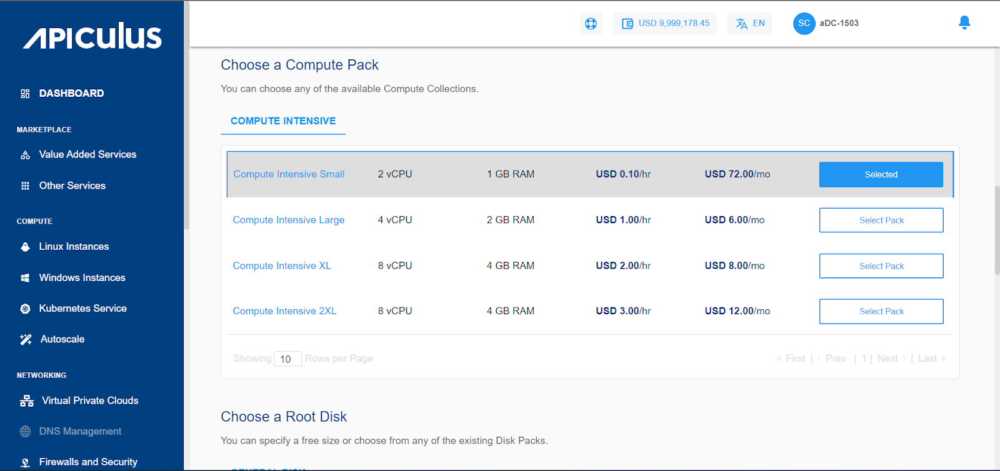

# Creating Linux Instances

Before creating a Linux instance, it is important to plan the architecture, networking and access to the Linux Instances. As a thumb rule:

- You can use a ‘Basic/Flat’  (or EC, elastic compute) Linux Instance to get started quickly and set up your Linux Instances behind apiculus Cloud’s global server load balancer (GSLB) and control access by setting up virtual firewall rules; or;
- You can use a ‘tiered’ network (or Advanced VPC, virtual private cloud) Linux Instances to configure advanced networking and application architectures and control access by setting up access control lists.

## Creating a Linux Instance on a  Basic/Flat/EC Network

To create a Linux instance on a basic/flat networking zone, follow the below steps:

1. Navigate to **Compute > Linux Instances**.
2. Click on the **_+_ NEW LINUX INSTANCE** from the top right.
3. Enter the name for your Linux instance by following the naming convention mentioned below in the helper text.
4. Choose an Availability Zone, which is the geographical region where your Instance will be deployed. The chosen option should be the Basic/Flat/EC type networking zones from all available AZs.
5. Choose a security group from the available options. 
6. Choose an Image to run on your Instance. This can be an operating system or a custom image that is available under **MY IMAGES.**
7. Choose a compute pack from the available compute collections.
8. Choose a Root disk from the available Disk packs, or you can use the free size option to specify the Root Disk.
9. You can choose one or multiple Instant Apps to deploy with the Linux Instance. This is optional, and apps will be available to you as per the catalogue.
10. Choose an authentication method, i.e., Use an SSH key pair or the root user password. 
    1. Clicking on the Use SSH key pair option, all the SSH key pairs present in your account will be listed; if your account doesn’t have any SSH key pair, then you can use the Generate a new key pair option, and also you can upload the key by selecting Upload a key pair.
    2. On selecting Use root user password, Also email me the password option will be displayed. If you select this option, the password, along with the details, for instance, will be emailed to your registered email ID.
11. Verify the Estimated Cost of your Linux Instance based on the specifications you have chosen from the Summary and Estimated Costs Section (Here both Hourly and Monthly Prices summary will be displayed).
12. Click on the check box after going through the policies mentioned by your cloud service provider.
13. Clicking on the BUY HOURLY or BUY MONTHLY button, a confirmation pop-over will open up, and the price summary will be displayed along with the discount codes if you have any in your account. 
    1. You can apply any of the discount codes listed by clicking on the **APPLY** button. 
    2. You can also remove the applied discount code by clicking the **REMOVE** button. 
    3. Clicking on the **CANCEL** button, this action will be canceled.
14. Click on the **CONFIRM** to create the Linux Instance.

Please note that this might take up to 5-8 minutes. You may use the CloudConsole during this time, but it is advised that you do not refresh the browser window.

Once ready, you’ll be notified of this purchase on your email address on record. The newly created Linux Instances can be accessed from **Compute >** **Linux Instances** on the main navigation panel.

## Creating a Linux Instance on a Tiered/Advanced VPC Network

To create a Linux instance on an advanced VPC AZ, follow the below steps:

1. Navigate to **Compute > Linux** **Instances**
2. Click on the **+ NEW LINUX INSTANCE** from the top right.
3. Enter the name for your Linux instance by following the naming convention mentioned below in the helper text.
4. Choose an Availability Zone, which is the geographical region where your Instance will be deployed. The chosen option should be the **advanced VPC** from all available AZs.
5.  Select a VPC network from the **Select Network** Dropdown and select the appropriate tier listed in **Select a Network Tier**. _Please note that to add a Linux Instance to a VPC, you need to have a VPC configured with at least one tier._ To know more about how to create VPC, please click here.
6. Choose an Image to run on your Instance. This can be an operating system or a custom image that is available under **MY IMAGES**
7. Choose a compute pack from the available compute collections.
8. Choose a Root disk from the available Disk packs, or you can use the free size option to specify the Root Disk.
9. You can choose one or multiple Instant Apps to deploy with the Linux Instance. This is optional and apps will be available to you as per the catalogue.
10. Choose an authentication method, i.e., Use an SSH key pair or the root user password. 
    1. Clicking on the Use SSH key pair option, all the SSH key pairs present in your account will be listed; if your account doesn’t have any SSH key pair, then you can use the Generate a new key pair option, and also you can upload the key by selecting Upload a key pair.
    2. On selecting Use root user password, Also email me the password option will be displayed, and if you select this option, the password, along with the details, for instance, will be emailed to your registered email ID.
11. Verify the Estimated Cost of your Linux Instance based on the specifications you have   chosen from the Summary and Estimated Costs Section( _Here, both Hourly and Monthly Prices summary will be displayed)_
12. Click on the check box after going through the policies mentioned by your cloud service provider.
13. Clicking on the BUY HOURLY or BUY MONTHLY button, a confirmation pop-over will open up and the price summary will be displayed along with the discount codes if you have any in your account. 
    1. You can apply any of the discount codes listed by clicking on the **APPLY** button. 
    2. You can also remove the applied discount code by clicking the **REMOVE** button 
    3. Clicking on the **CANCEL** button, this action will be canceled.
14. Click on the **CONFIRM** to create the Linux Instance.

Please note that this might take up to 5-8 minutes. You may use the CloudConsole during this time, but it is advised that you do not refresh the browser window.

Once ready, you’ll be notified of this purchase on your email address on record. The newly created Linux Instances can be accessed from **Compute >** **Linux Instances** on the main navigation panel.

:::note
When deploying a CentOS Instance with MySQL, note that in CentOS, the MySQL package is equipped with a default temporary password post-installation. 

To obtain this password for accessing MySQL, execute the following command.

`sudo grep ' temporary password ' /var/log/mysqld.log`

:::

The above command will reveal the temporary password necessary for MySQL Login.

:::note
The App Overlays feature is unavailable for RHEL 7 & RHEL 8.
:::